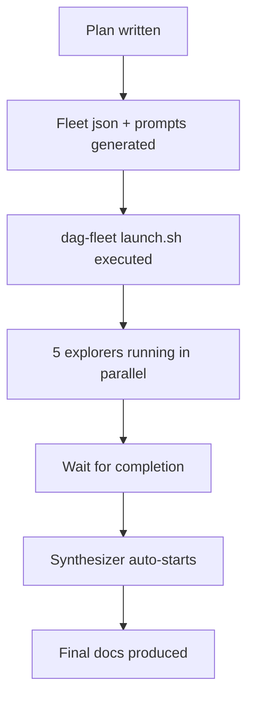

# Fleet Launched

## What
- Experiment 1 "understanding-codebase" created
- Plan "codebase-exploration" written at `docs/experiments/001-understanding-codebase/plans/01-codebase-exploration.md`
- dag-fleet configured with 6 workers (5 explorers + 1 synthesizer)
- Fleet launched using codex gpt-5.5 medium, $10 budget per worker
- All prompt.md files and fleet.json created at `/home/sagar/temp/qmd/docs/experiments/001-understanding-codebase/`

## Key Takeaways
- User prefers ASCII diagrams over mermaid (except when complexity demands it)
- All workers use codex provider with gpt-5.5 model, reasoning_effort medium
- Fleet root is inside the experiment docs folder (self-contained)
- Synthesizer has `depends_on` all 5 explorers — DAG ordering enforced by launch.sh

## Issues
- None so far. Launch succeeded on first try.

## Decisions
- dag-fleet chosen over worktree-fleet because explorers only READ source files, no file overlap conflicts
- "write" worker type chosen for all workers (they need Read + Write, no Bash needed)
- Per-worker budget $10 (user-specified), fleet cap $60
- Max concurrent 5 (all explorers at once, synthesizer waits)

## Next
1. Monitor fleet status: `bash /home/sagar/.pi/agent/skills/dag-fleet/scripts/status.sh /home/sagar/temp/qmd/docs/experiments/001-understanding-codebase --watch`
2. Wait for all explorers to finish
3. Synthesizer will auto-launch when deps complete
4. When fleet done, run report: `bash /home/sagar/.pi/agent/skills/dag-fleet/scripts/report.sh /home/sagar/temp/qmd/docs/experiments/001-understanding-codebase`
5. Read synthesizer outputs: `L0-overview.md`, `L1-modules.md`, `L2-implementation.md`, `architecture.asc`
6. Present results to user
