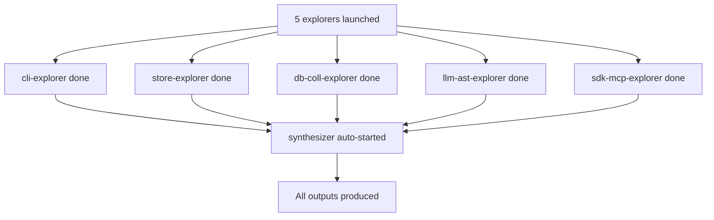

# Fleet Complete

## What
- dag-fleet completed successfully — all 6 workers done, 0 failures
- Total cost: $6.87 (well under $60 fleet cap)
- 18 explorer files + 4 synthesizer files produced
- All diagrams are ASCII (no mermaid), as requested

## Key Takeaways
- Codex gpt-5.5 medium handled code analysis well — deep function inventories, accurate signatures
- Synthesizer successfully cross-referenced all 5 explorer outputs into unified L0/L1/L2 docs
- architecture.asc is a comprehensive ASCII diagram showing all components, data stores, and flows
- L2-implementation.md includes exact formulas: RRF weight math, chunking distance decay, BM25 normalization, query expansion grammar constraints
- One finding: AST grammar version drift — package.json lists tree-sitter-go/python at 0.25.0 but ast.ts error messages cite 0.23.4

## Issues
- report.sh shows stale status (all RUNNING) — workers actually DONE; status.json was read before final flush
- No actual worker failures

## Decisions
- Kept ASCII diagrams throughout (user preference over mermaid)
- Synthesizer used `opus` model instruction but ran on gpt-5.5 (codex fleet) — still produced quality output
- Fleet root inside experiment docs folder kept everything self-contained

## Next
- Review synthesizer outputs: L0-overview.md, L1-modules.md, L2-implementation.md, architecture.asc
- Copy final docs to a more accessible location if needed
- Iterate on specific sections if user wants deeper dives
- File paths for all outputs:
  - Final docs: `docs/experiments/001-understanding-codebase/workers/synthesizer/output/`
  - Explorer outputs: `docs/experiments/001-understanding-codebase/workers/{worker-id}/output/`
