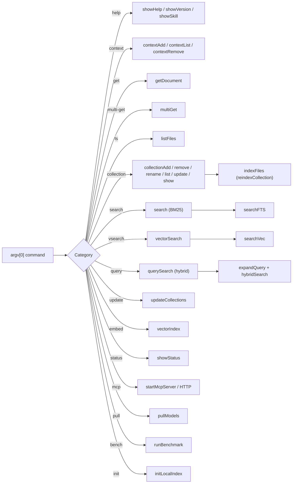
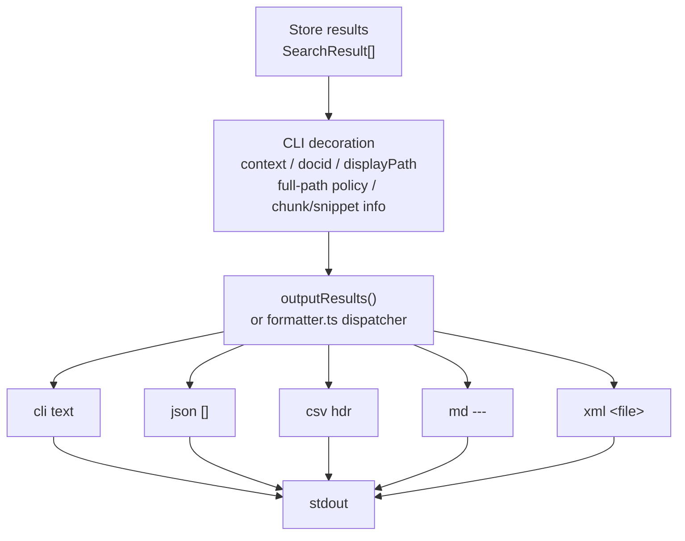
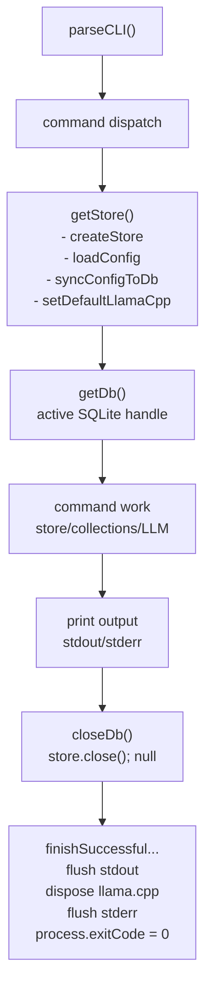

# CLI Diagrams

## CLI Command Dispatch Table

```mermaid
graph LR
    CMD["argv[0] command"] --> CAT{Category}

    CAT -->|help| H["showHelp / showVersion / showSkill"]
    CAT -->|context| C["contextAdd / contextList / contextRemove"]
    CAT -->|get| G["getDocument"]
    CAT -->|multi-get| MG["multiGet"]
    CAT -->|ls| LS["listFiles"]
    CAT -->|collection| COL["collectionAdd / remove / rename / list / update / show"]
    CAT -->|search| S["search (BM25)"]
    CAT -->|vsearch| VS["vectorSearch"]
    CAT -->|query| Q["querySearch (hybrid)"]
    CAT -->|update| U["updateCollections"]
    CAT -->|embed| E["vectorIndex"]
    CAT -->|status| ST["showStatus"]
    CAT -->|mcp| MCP["startMcpServer / HTTP"]
    CAT -->|pull| PL["pullModels"]
    CAT -->|bench| B["runBenchmark"]
    CAT -->|init| I["initLocalIndex"]

    COL --> IDX["indexFiles (reindexCollection)"]
    Q --> EXP["expandQuery + hybridSearch"]
    S --> FTS["searchFTS"]
    VS --> VEC["searchVec"]
```

## Output Format Pipeline

```mermaid
graph TD
    A["Store results<br/>SearchResult[]"] --> B["CLI decoration<br/>context / docid / displayPath<br/>full-path policy / chunk/snippet info"]
    B --> C["outputResults()<br/>or formatter.ts dispatcher"]
    C --> D["cli text"]
    C --> E["json []"]
    C --> F["csv hdr"]
    C --> G["md ---"]
    C --> H["xml &lt;file&gt;"]
    D --> I[stdout]
    E --> I
    F --> I
    G --> I
    H --> I
```

## Lifecycle Diagram

```mermaid
graph TD
    A["parseCLI()"] --> B["command dispatch"]
    B --> C["getStore()<br/>- createStore<br/>- loadConfig<br/>- syncConfigToDb<br/>- setDefaultLlamaCpp"]
    C --> D["getDb()<br/>active SQLite handle"]
    D --> E["command work<br/>store/collections/LLM"]
    E --> F["print output<br/>stdout/stderr"]
    F --> G["closeDb()<br/>store.close(); null"]
    G --> H["finishSuccessful...<br/>flush stdout<br/>dispose llama.cpp<br/>flush stderr<br/>process.exitCode = 0"]
```
