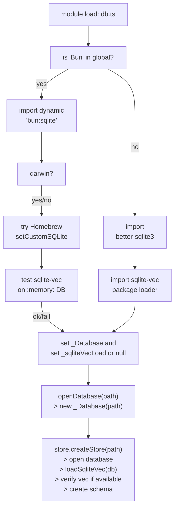
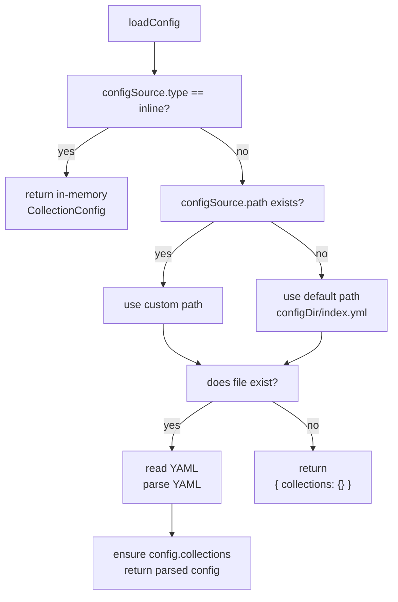
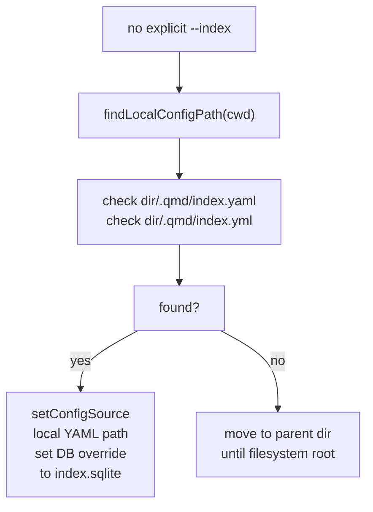
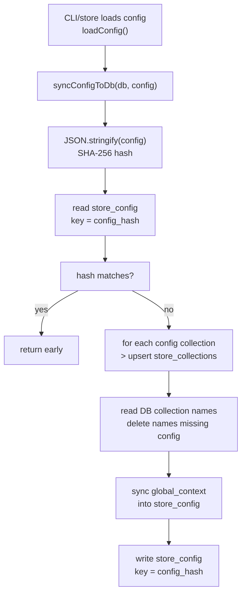
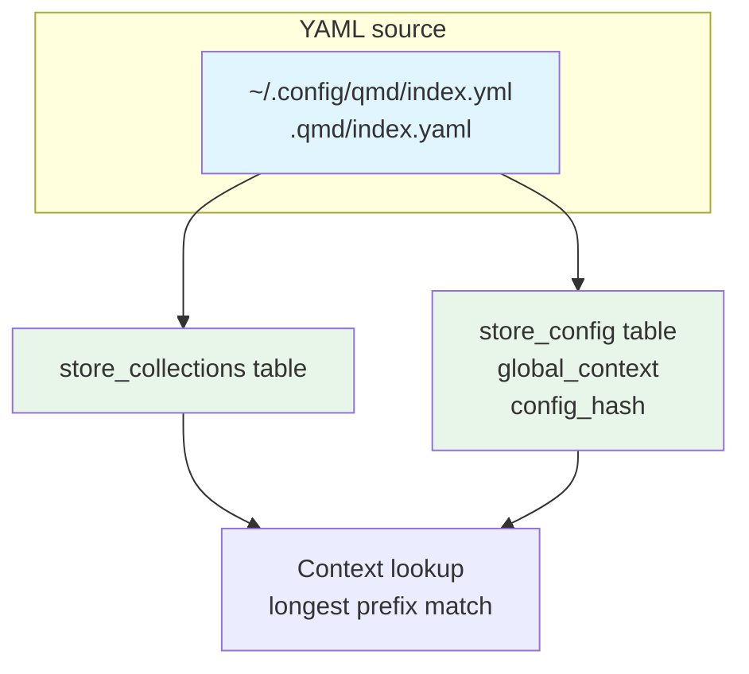

## DB initialization flow

```mermaid
graph TD
    A["module load: db.ts"] --> B["is 'Bun' in global?"]
    B -->|yes| C["import dynamic<br/>'bun:sqlite'"]
    B -->|no| D["import<br/>better-sqlite3"]
    C --> E[darwin?]
    D --> F["import sqlite-vec<br/>package loader"]
    E -->|yes/no| G["try Homebrew<br/>setCustomSQLite"]
    G --> H["test sqlite-vec<br/>on :memory: DB"]
    H -->|ok/fail| I["set _Database and<br/>set _sqliteVecLoad or null"]
    F --> I
    I --> J["openDatabase(path)<br/>> new _Database(path)"]
    J --> K["store.createStore(path)<br/>> open database<br/>> loadSqliteVec(db)<br/>> verify vec if available<br/>> create schema"]
```

## Config load flow

```mermaid
graph TD
    A[loadConfig] --> B["configSource.type == inline?"]
    B -->|yes| C["return in-memory<br/>CollectionConfig"]
    B -->|no| D["configSource.path exists?"]
    D -->|yes| E["use custom path"]
    D -->|no| F["use default path<br/>configDir/index.yml"]
    E --> G["does file exist?"]
    F --> G
    G -->|yes| H["read YAML<br/>parse YAML"]
    G -->|no| I["return<br/>{ collections: {} }"]
    H --> J["ensure config.collections<br/>return parsed config"]
```

Project-local discovery used by the CLI before default config:

```mermaid
graph TD
    A["no explicit --index"] --> B["findLocalConfigPath(cwd)"]
    B --> C["check dir/.qmd/index.yaml<br/>check dir/.qmd/index.yml"]
    C --> D["found?"]
    D -->|yes| E["setConfigSource<br/>local YAML path<br/>set DB override<br/>to index.sqlite"]
    D -->|no| F["move to parent dir<br/>until filesystem root"]
```

## Config sync flow

```mermaid
graph TD
    A["CLI/store loads config<br/>loadConfig()"] --> B["syncConfigToDb(db, config)"]
    B --> C["JSON.stringify(config)<br/>SHA-256 hash"]
    C --> D["read store_config<br/>key = config_hash"]
    D --> E["hash matches?"]
    E -->|yes| F[return early]
    E -->|no| G["for each config collection<br/>> upsert store_collections"]
    G --> H["read DB collection names<br/>delete names missing config"]
    H --> I["sync global_context<br/>into store_config"]
    I --> J["write store_config<br/>key = config_hash"]
```

## Collections + contexts data model

```mermaid
graph TD
    subgraph "YAML source"
        Y["~/.config/qmd/index.yml<br/>.qmd/index.yaml"]
    end

    Y --> S["store_collections table"]
    Y --> C["store_config table<br/>global_context<br/>config_hash"]

    S --> L["Context lookup<br/>longest prefix match"]
    C --> L

    style Y fill:#e1f5fe
    style S fill:#e8f5e9
    style C fill:#e8f5e9
```
