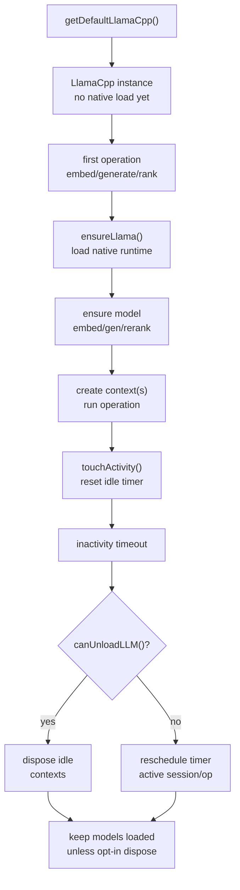
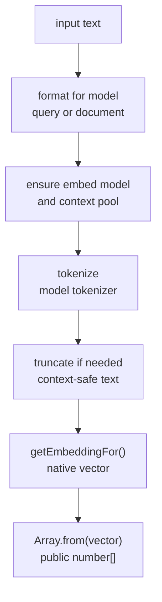
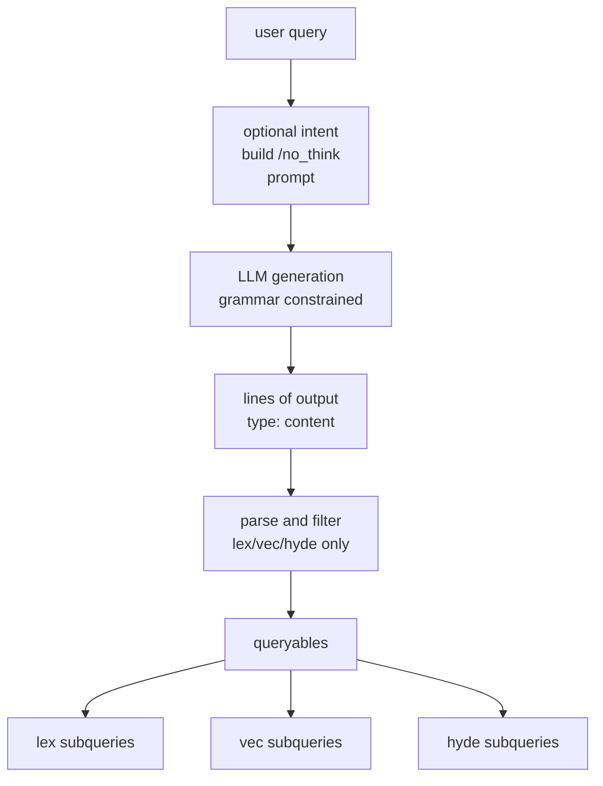
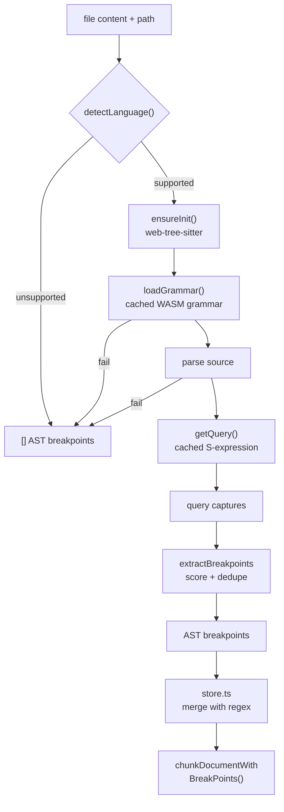
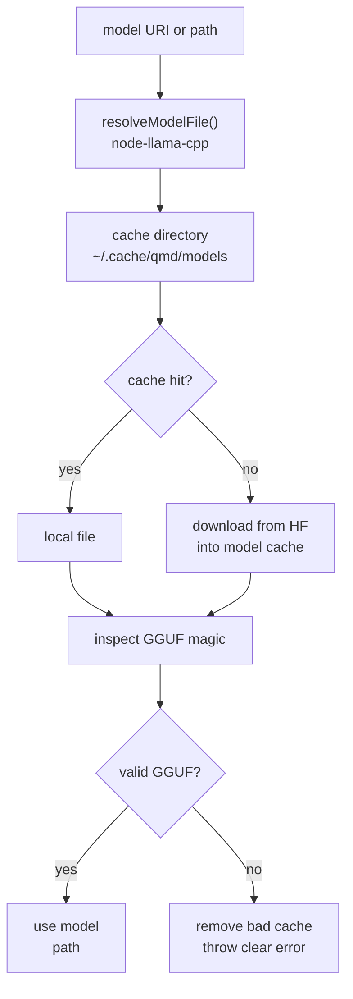

## LLM Lifecycle

```mermaid
flowchart TD
    A["getDefaultLlamaCpp()"] --> B["LlamaCpp instance<br/>no native load yet"]
    B --> C["first operation<br/>embed/generate/rank"]
    C --> D["ensureLlama()<br/>load native runtime"]
    D --> E["ensure model<br/>embed/gen/rerank"]
    E --> F["create context(s)<br/>run operation"]
    F --> G["touchActivity()<br/>reset idle timer"]
    G --> H["inactivity timeout"]
    H --> I{"canUnloadLLM()?"}
    I -->|"yes"| J["dispose idle<br/>contexts"]
    I -->|"no"| K["reschedule timer<br/>active session/op"]
    J --> L["keep models loaded<br/>unless opt-in dispose"]
    K --> L
```

## Embedding Pipeline

```mermaid
flowchart TD
    A["input text"] --> B["format for model<br/>query or document"]
    B --> C["ensure embed model<br/>and context pool"]
    C --> D["tokenize<br/>model tokenizer"]
    D --> E["truncate if needed<br/>context-safe text"]
    E --> F["getEmbeddingFor()<br/>native vector"]
    F --> G["Array.from(vector)<br/>public number[]"]
```

## Query Expansion Flow

```mermaid
flowchart TD
    A["user query"] --> B["optional intent<br/>build /no_think<br/>prompt"]
    B --> C["LLM generation<br/>grammar constrained"]
    C --> D["lines of output<br/>type: content"]
    D --> E["parse and filter<br/>lex/vec/hyde only"]
    E --> F["queryables"]
    F --> G["lex subqueries"]
    F --> H["vec subqueries"]
    F --> I["hyde subqueries"]
```

## AST Chunking Flow

```mermaid
flowchart TD
    A["file content + path"] --> B{"detectLanguage()"}
    B -->|"unsupported"| C["[] AST breakpoints"]
    B -->|"supported"| D["ensureInit()<br/>web-tree-sitter"]
    D --> E["loadGrammar()<br/>cached WASM grammar"]
    E -->|"fail"| C
    E --> F["parse source"]
    F -->|"fail"| C
    F --> G["getQuery()<br/>cached S-expression"]
    G --> H["query captures"]
    H --> I["extractBreakpoints<br/>score + dedupe"]
    I --> J["AST breakpoints"]
    J --> K["store.ts<br/>merge with regex"]
    K --> L["chunkDocumentWith<br/>BreakPoints()"]
```

## Model Resolution

```mermaid
flowchart TD
    A["model URI or path"] --> B["resolveModelFile()<br/>node-llama-cpp"]
    B --> C["cache directory<br/>~/.cache/qmd/models"]
    C --> D{"cache hit?"}
    D -->|"yes"| E["local file"]
    D -->|"no"| F["download from HF<br/>into model cache"]
    E --> G["inspect GGUF magic"]
    F --> G
    G --> H{"valid GGUF?"}
    H -->|"yes"| I["use model<br/>path"]
    H -->|"no"| J["remove bad cache<br/>throw clear error"]
```
