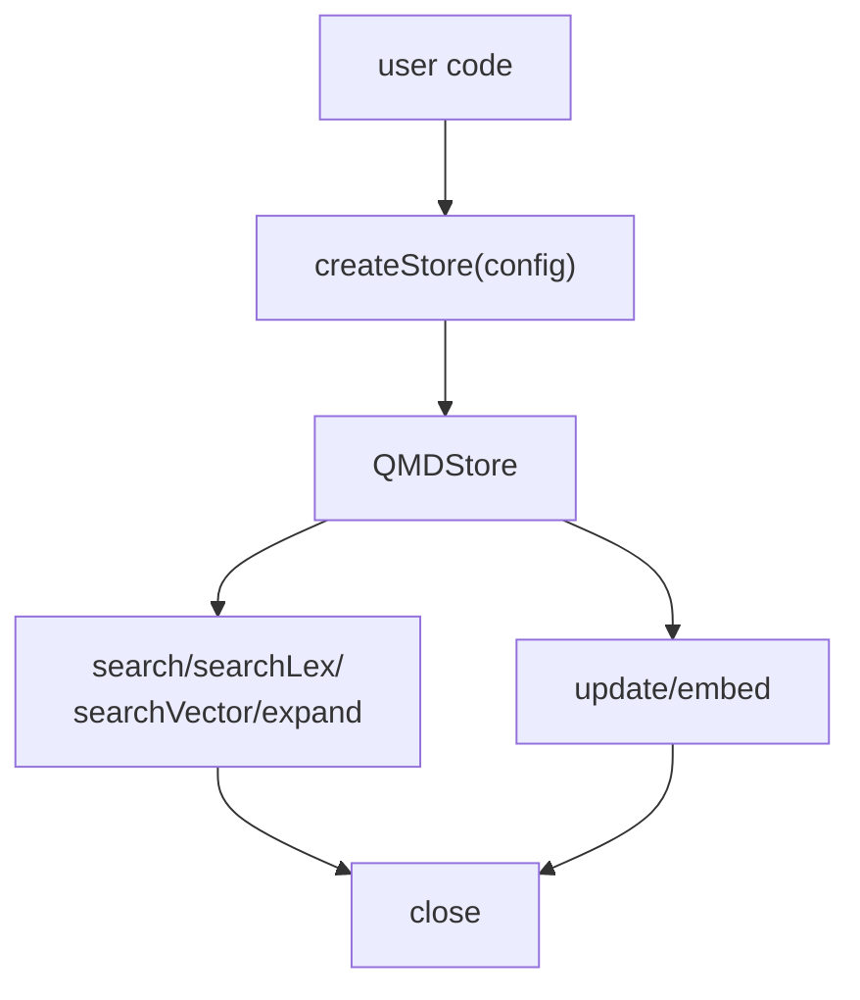
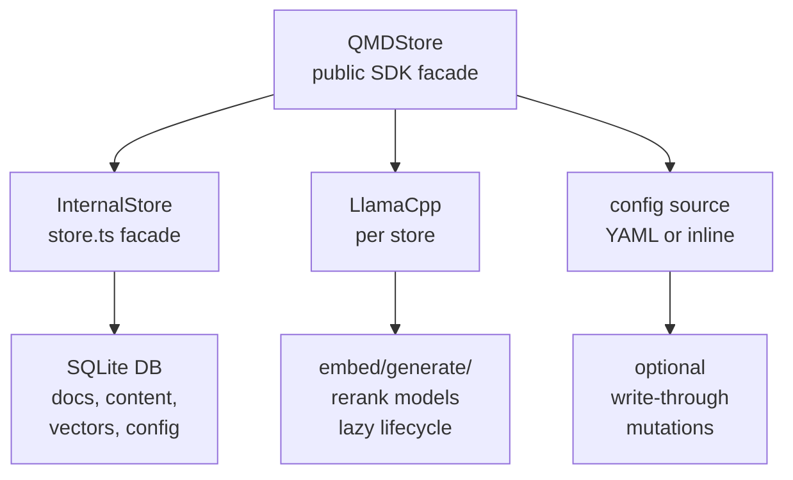
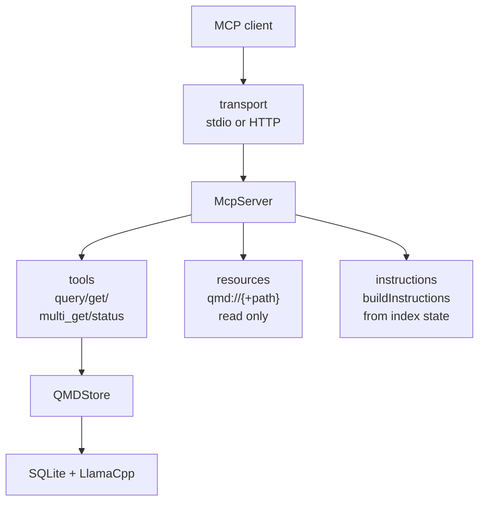
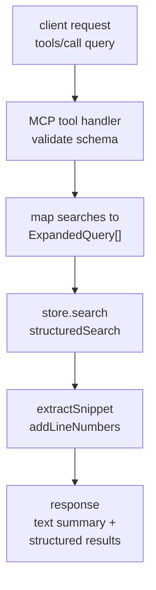
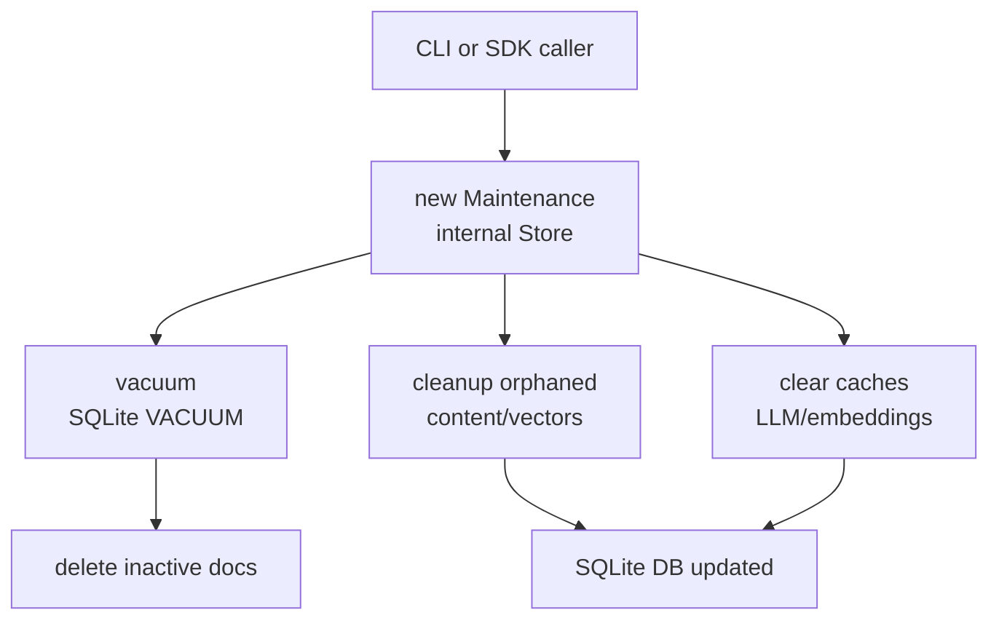

## SDK Usage Flow

```mermaid
flowchart TD
    A["user code"] --> B["createStore(config)"]
    B --> C["QMDStore"]
    C --> D["search/searchLex/<br/>searchVector/expand"]
    C --> E["update/embed"]
    D --> F["close"]
    E --> F
```

## SDK Internal Architecture

```mermaid
flowchart TD
    A["QMDStore<br/>public SDK facade"] --> B["InternalStore<br/>store.ts facade"]
    A --> C["LlamaCpp<br/>per store"]
    A --> D["config source<br/>YAML or inline"]
    B --> E["SQLite DB<br/>docs, content,<br/>vectors, config"]
    C --> F["embed/generate/<br/>rerank models<br/>lazy lifecycle"]
    D --> G["optional<br/>write-through<br/>mutations"]
```

## MCP Architecture

```mermaid
flowchart TD
    A["MCP client"] --> B["transport<br/>stdio or HTTP"]
    B --> C["McpServer"]
    C --> D["tools<br/>query/get/<br/>multi_get/status"]
    C --> E["resources<br/>qmd://{+path}<br/>read only"]
    C --> F["instructions<br/>buildInstructions<br/>from index state"]
    D --> G["QMDStore"]
    G --> H["SQLite + LlamaCpp"]
```

## MCP Tool Call Flow

```mermaid
flowchart TD
    A["client request<br/>tools/call query"] --> B["MCP tool handler<br/>validate schema"]
    B --> C["map searches to<br/>ExpandedQuery[]"]
    C --> D["store.search<br/>structuredSearch"]
    D --> E["extractSnippet<br/>addLineNumbers"]
    E --> F["response<br/>text summary +<br/>structured results"]
```

## Maintenance Operations Flow

```mermaid
flowchart TD
    A["CLI or SDK caller"] --> B["new Maintenance<br/>internal Store"]
    B --> C["vacuum<br/>SQLite VACUUM"]
    B --> D["cleanup orphaned<br/>content/vectors"]
    B --> E["clear caches<br/>LLM/embeddings"]
    C --> F["delete inactive docs"]
    D --> G["SQLite DB updated"]
    E --> G
```
