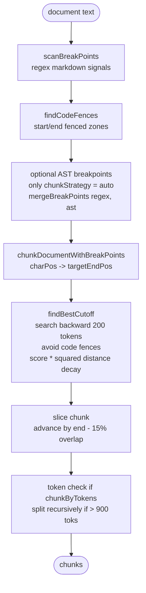
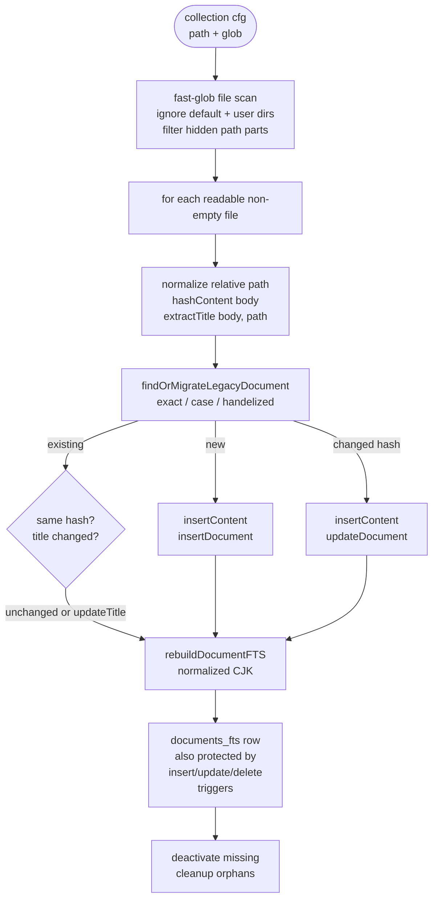
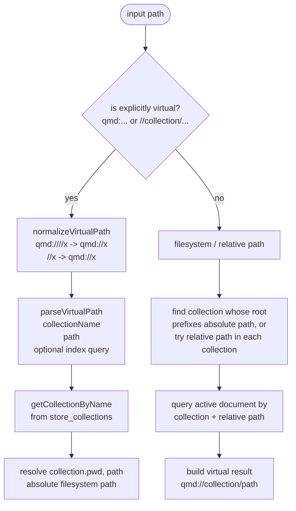

# Store Layer Diagrams

ASCII only. No Mermaid.

## Search Pipeline

```mermaid
flowchart TD
    A([user query]) --> B[initial BM25 / FTS<br/>searchFTS query]
    B --> C{strong signal?<br/>top >= 0.85 and gap >= 0.15<br/>and no intent}
    C -->|yes| D[skip expansion<br/>expanded = []]
    C -->|no| E[expandQuery<br/>-> lex / vec / hyde]
    D --> F[route retrieval lists]
    E --> F
    F --> G[FTS lists<br/>original + lex<br/>searchFTS]
    F --> H[vector lists<br/>original + vec + hyde<br/>embedBatch + searchVec]
    G --> I[weighted RRF fusion<br/>original lists: 2.0<br/>expansion lists: 1.0]
    H --> I
    I --> J[top candidateLimit docs<br/>default 40]
    J --> K[chunk each document<br/>choose best text chunk]
    K --> L{skipRerank}
    L -->|true| M[score = 1 / rank]
    L -->|false| N[rerank selected chunks<br/>cached LLM reranker]
    N --> O[position-aware blend<br/>RRF rank + rerank score]
    O --> P
    M --> P[dedupe by file<br/>filter minScore<br/>slice limit]
    P --> Q([results])
```

## Chunking Pipeline



## Indexing Pipeline



## Database Schema


## Virtual Path Resolution Flow


