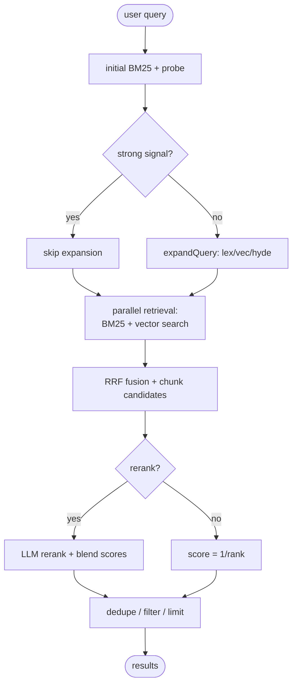
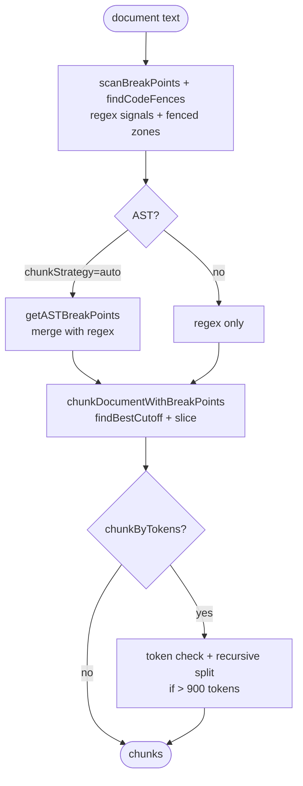
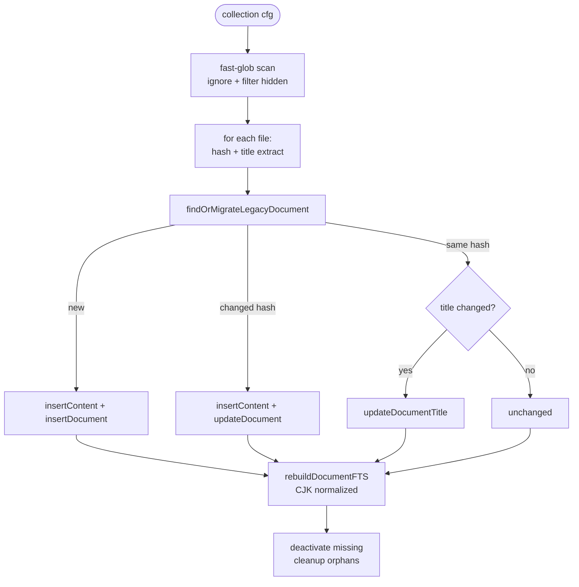
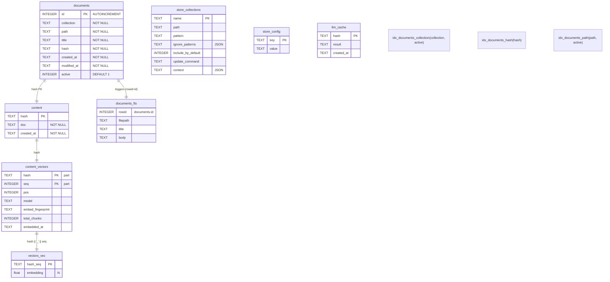
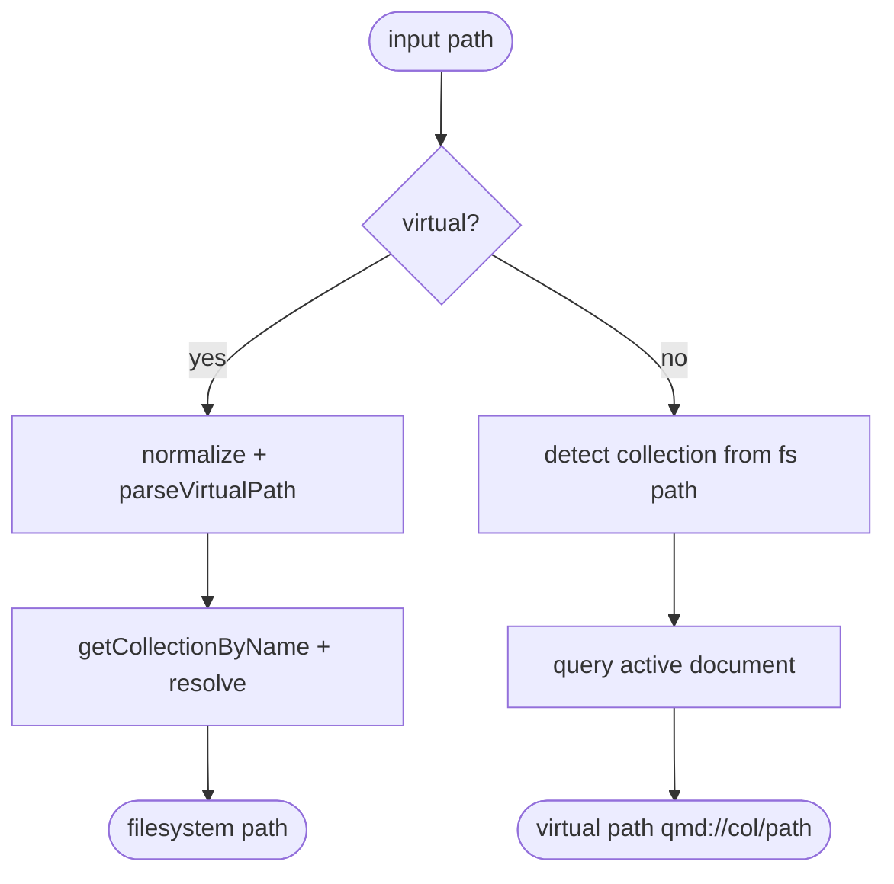

# Store Layer Diagrams

ASCII only. No Mermaid.

## Search Pipeline

```mermaid
flowchart TD
    A([user query]) --> B["initial BM25 + probe"]
    B --> C{strong signal?}
    C -->|yes| D["skip expansion"]
    C -->|no| E["expandQuery: lex/vec/hyde"]
    D --> F["parallel retrieval:<br/>BM25 + vector search"]
    E --> F
    F --> G["RRF fusion + chunk candidates"]
    G --> H{rerank?}
    H -->|yes| I["LLM rerank + blend scores"]
    H -->|no| J["score = 1/rank"]
    I --> K["dedupe / filter / limit"]
    J --> K
    K --> L([results])
```

## Chunking Pipeline

```mermaid
flowchart TD
    A([document text]) --> B["scanBreakPoints + findCodeFences<br/>regex signals + fenced zones"]
    B --> C{AST?}
    C -->|chunkStrategy=auto| D["getASTBreakPoints<br/>merge with regex"]
    C -->|no| E["regex only"]
    D --> F["chunkDocumentWithBreakPoints<br/>findBestCutoff + slice"]
    E --> F
    F --> G{chunkByTokens?}
    G -->|yes| H["token check + recursive split<br/>if > 900 tokens"]
    G -->|no| I([chunks])
    H --> I
```

## Indexing Pipeline

```mermaid
flowchart TD
    A([collection cfg]) --> B["fast-glob scan<br/>ignore + filter hidden"]
    B --> C["for each file:<br/>hash + title extract"]
    C --> D["findOrMigrateLegacyDocument"]
    D -->|new| E["insertContent + insertDocument"]
    D -->|same hash| F{title changed?}
    D -->|changed hash| G["insertContent + updateDocument"]
    F -->|yes| H["updateDocumentTitle"]
    F -->|no| I["unchanged"]
    E --> J["rebuildDocumentFTS<br/>CJK normalized"]
    G --> J
    H --> J
    I --> J
    J --> K["deactivate missing<br/>cleanup orphans"]
```

## Database Schema

```mermaid
erDiagram
    content {
        TEXT hash PK
        TEXT doc "NOT NULL"
        TEXT created_at "NOT NULL"
    }

    documents {
        INTEGER id PK "AUTOINCREMENT"
        TEXT collection "NOT NULL"
        TEXT path "NOT NULL"
        TEXT title "NOT NULL"
        TEXT hash "NOT NULL"
        TEXT created_at "NOT NULL"
        TEXT modified_at "NOT NULL"
        INTEGER active "DEFAULT 1"
    }

    documents_fts {
        INTEGER rowid "documents.id"
        TEXT filepath
        TEXT title
        TEXT body
    }

    content_vectors {
        TEXT hash PK "part"
        INTEGER seq PK "part"
        INTEGER pos
        TEXT model
        TEXT embed_fingerprint
        INTEGER total_chunks
        TEXT embedded_at
    }

    vectors_vec {
        TEXT hash_seq PK
        float embedding "N"
    }

    store_collections {
        TEXT name PK
        TEXT path
        TEXT pattern
        TEXT ignore_patterns "JSON"
        INTEGER include_by_default
        TEXT update_command
        TEXT context "JSON"
    }

    store_config {
        TEXT key PK
        TEXT value
    }

    llm_cache {
        TEXT hash PK
        TEXT result
        TEXT created_at
    }

    documents ||--|| content : "hash FK"
    documents ||--|| documents_fts : "triggers (rowid=id)"
    content ||--|| content_vectors : "hash"
    content_vectors ||--|| vectors_vec : "hash || '_' || seq"

    idx_documents_collection["idx_documents_collection(collection, active)"]
    idx_documents_hash["idx_documents_hash(hash)"]
    idx_documents_path["idx_documents_path(path, active)"]
```

## Virtual Path Resolution Flow

```mermaid
flowchart TD
    A([input path]) --> B{virtual?}
    B -->|yes| C["normalize + parseVirtualPath"]
    B -->|no| D["detect collection from fs path"]
    C --> E["getCollectionByName + resolve"]
    D --> F["query active document"]
    E --> G([filesystem path])
    F --> H([virtual path qmd://col/path])
```
