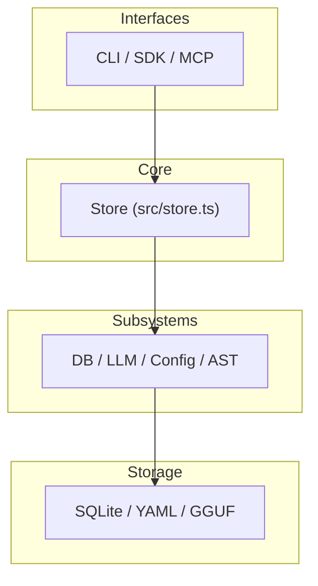
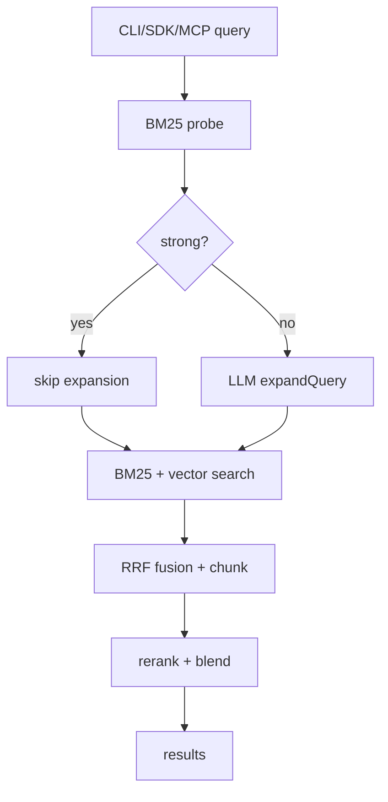
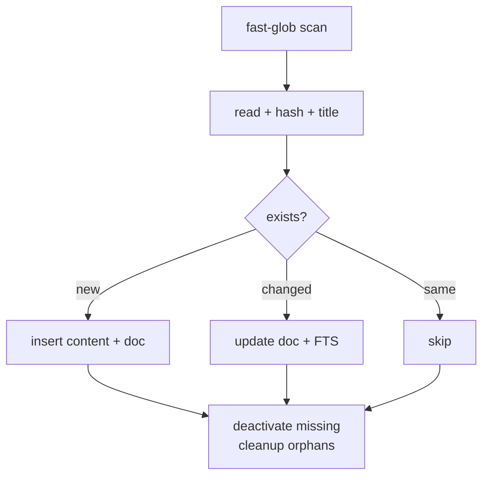

# QMD Architecture

## What are the main layers?
Top to bottom:
1. **Interfaces** — CLI (`src/cli/qmd.ts`), SDK (`src/index.ts`), MCP (`src/mcp/server.ts`).
2. **Core engine** — Store (`src/store.ts`) owns indexing, search, chunking, and caching.
3. **Subsystems** — DB compatibility (`src/db.ts`), LLM wrapper (`src/llm.ts`), collections/config (`src/collections.ts`), AST chunking (`src/ast.ts`).
4. **Storage** — SQLite (FTS5 + sqlite-vec), YAML config files, GGUF model cache (see L1-modules: Module Map).

## What does each module do?
| Module | File(s) | Responsibility |
|---|---|---|
| CLI | `src/cli/qmd.ts`, `src/cli/formatter.ts` | Argument parsing, command dispatch, terminal UX, formatting, lifecycle cleanup |
| SDK | `src/index.ts` | Public `QMDStore` facade: search, retrieval, collections, contexts, update, embed, close |
| Store | `src/store.ts` | SQLite schema, content-addressed storage, FTS, vector search, hybrid orchestration, chunking, docids |
| DB compat | `src/db.ts` | Runtime-neutral SQLite driver for Bun/Node; sqlite-vec loader |
| Collections | `src/collections.ts` | YAML/inline config I/O, local config discovery, context lookup, default collection logic |
| LLM | `src/llm.ts` | GGUF model loading, embeddings, generation, reranking, GPU/CPU selection |
| AST chunking | `src/ast.ts` | Optional tree-sitter breakpoints for supported code files |
| MCP | `src/mcp/server.ts` | MCP stdio/HTTP server, tools, resources, dynamic instructions |
| Maintenance | `src/maintenance.ts` | Thin wrapper around vacuum, orphan cleanup, inactive doc removal |

(see L1-modules: Module Map; cli-explorer: Overview; sdk-mcp-explorer: SDK Overview)

## How does a search query flow through the system?

(see L2-implementation: Search Pipeline; store-explorer: Hybrid Search)

## How does indexing work?

(see store-explorer: Indexing; L2-implementation: Indexing & Storage)

## What is content-addressable storage and why?
Document metadata lives in `documents` (collection, path, title, hash). Actual body text lives in `content` keyed by SHA-256 hash. If two paths have identical content, they share one `content` row and one embedding set. This deduplicates storage and keeps embeddings stable across renames (see store-explorer: Overview; Database Schema).

## What are the two search signals and how do they combine?
- **BM25 (lexical)** from FTS5 scores title, path, and body.
- **Vector (semantic)** from sqlite-vec cosine similarity between query and chunk embeddings.

Ranked lists from both signals are fused with Reciprocal Rank Fusion: `weight / (k + rank + 1)`. Original-query lists get weight 2.0; expansion-derived lists get 1.0 (see store-explorer: Hybrid Search; L2-implementation: Hybrid Fusion).

## What is query expansion and when does it happen?
The LLM rewrites a plain query into typed variants: `lex:` for keyword search, `vec:` for semantic search, and `hyde:` as a hypothetical answer document. Expansion is cached in `llm_cache` and skipped when the initial BM25 probe is already strong (`topScore >= 0.85` and gap `>= 0.15`) (see llm-ast-explorer: Query Expansion; store-explorer: Hybrid Search).

## What is the role of sqlite-vec?
sqlite-vec provides the `vectors_vec` virtual table for storing float vectors and performing cosine-similarity lookups. It is optional: if loading fails, FTS/BM25 search still works. Vector lookups are intentionally two-step (virtual table query first, then join) to avoid hangs (see db-coll-explorer: sqlite-vec Loading; store-explorer: Vector Search).

## What is the role of node-llama-cpp?
It loads local GGUF models for three tasks: embedding documents/queries, generating query expansions, and reranking candidate chunks. It also handles tokenization, context pooling, GPU backend selection, and idle cleanup (see llm-ast-explorer: LLM Layer Overview; Model Loading).

## What is AST chunking and when does it help?
AST chunking uses `web-tree-sitter` to find structural boundaries in code files (functions, classes, imports). It supports TypeScript, TSX, JavaScript, Python, Go, and Rust. When `chunkStrategy` is `"auto"`, AST breakpoints are merged with regex breakpoints, improving chunk boundaries for code while markdown still uses regex breakpoints (see llm-ast-explorer: AST Chunking Overview; store-explorer: Chunking).
