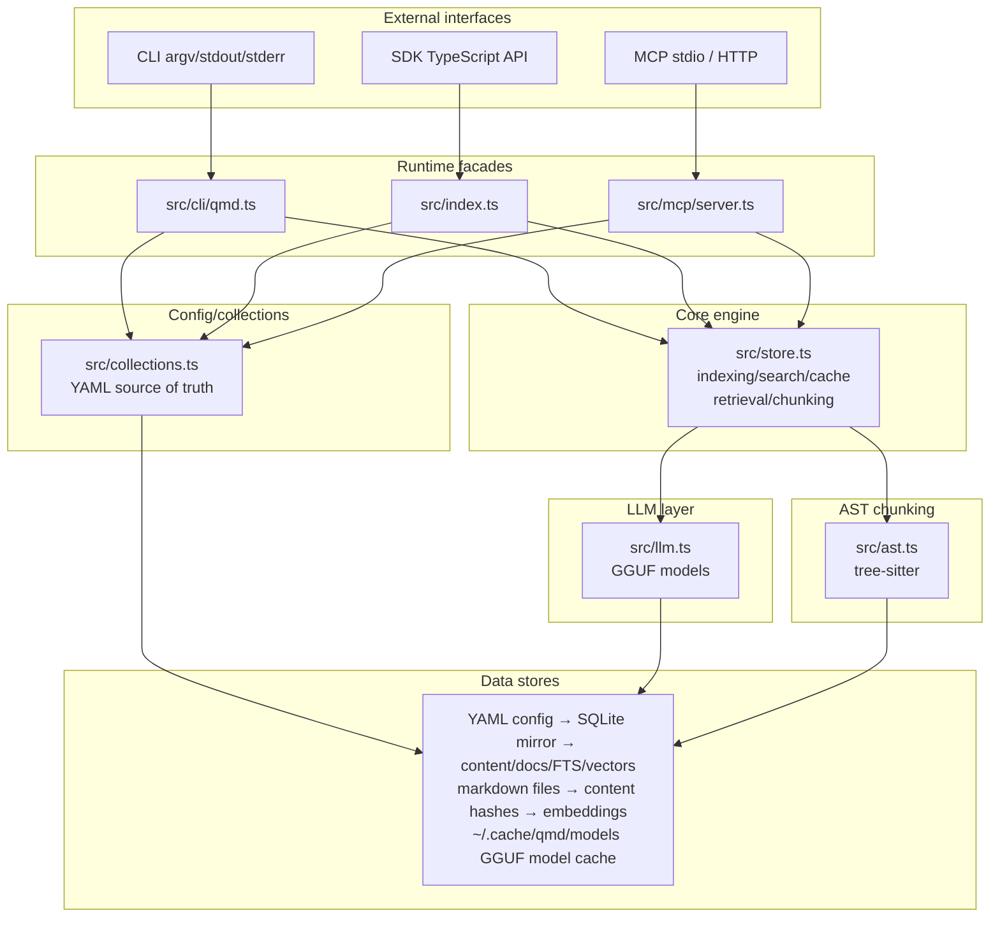

# QMD L0 Overview

QMD is a local-first markdown indexing and retrieval system. It indexes configured folders into a SQLite database, stores document bodies by content hash, supports keyword and semantic search, and exposes the same index through a command-line app, TypeScript SDK, and MCP server (see cli-explorer: Overview; store-explorer: Overview; sdk-mcp-explorer: SDK Overview and MCP Overview).

## Problem It Solves

QMD makes a personal or project markdown corpus searchable by both exact lexical terms and semantic meaning, while preserving local control over files, models, and storage. It solves the gap between simple `grep`-style lookup and LLM-assisted retrieval by combining SQLite FTS5, sqlite-vec embeddings, local GGUF models, configurable collections, inherited context, and document retrieval by stable virtual paths or docids (see store-explorer: BM25 Search, Vector Search, Hybrid Search; db-coll-explorer: Collections Layer Overview).

## Key Capabilities

- Configure markdown collections in YAML, mirror them into SQLite, and index/update them incrementally (see db-coll-explorer: Config Sync; store-explorer: Indexing).
- Search with BM25 keyword search, vector similarity, or hybrid query expansion and reranking (see store-explorer: Hybrid Search; llm-ast-explorer: Query Expansion and Reranking).
- Retrieve single or multiple documents by docid, virtual path, filesystem path, glob, or suffix match (see cli-explorer: `get`, `multi-get`; store-explorer: Exported Function Inventory: `findDocument`, `findDocuments`).
- Generate embeddings with local llama.cpp GGUF models and sqlite-vec storage (see store-explorer: Embeddings Pipeline; llm-ast-explorer: Embedding Generation).
- Serve the same index through CLI, SDK, MCP stdio, MCP HTTP, and REST-like HTTP query endpoints (see cli-explorer: Commands; sdk-mcp-explorer: MCP Overview).
- Maintain the index by clearing LLM cache, removing inactive docs, cleaning orphaned content/vectors, and vacuuming SQLite (see sdk-mcp-explorer: Maintenance).

## System Architecture

## Tech Stack Summary

- Language/runtime: TypeScript running on Node or Bun through a narrow SQLite compatibility layer (see db-coll-explorer: DB Layer Overview).
- Database: SQLite via `better-sqlite3` on Node or `bun:sqlite` on Bun; FTS5 for BM25 search; sqlite-vec for cosine vector search when available (see db-coll-explorer: Bun vs Node Path; store-explorer: BM25 Search and Vector Search).
- LLM runtime: `node-llama-cpp` with local GGUF models for embeddings, generation/query expansion, and reranking (see llm-ast-explorer: LLM Layer Overview and Model Loading).
- Config: YAML collection config with optional inline SDK config, mirrored to SQLite using a config hash (see db-coll-explorer: Config Resolution and Config Sync).
- Parsing/chunking: regex markdown breakpoints plus optional `web-tree-sitter` AST breakpoints for supported code files (see store-explorer: Chunking; llm-ast-explorer: AST Chunking Overview).
