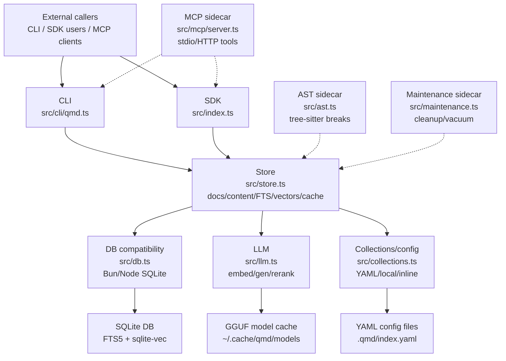

# QMD L1 Module Architecture

Approximate LOC values are estimates from explorer inventories and subsystem breadth; the explorer outputs did not include measured line counts. Source files were not re-read for this synthesis.

## Module Map

| Module | File(s) | Responsibility | Approx LOC | Dependencies |
|---|---|---:|---:|---|
| CLI | `src/cli/qmd.ts`, `src/cli/formatter.ts` | Argument parsing, command dispatch, terminal output, config sync, indexing/search/retrieval orchestration, lifecycle cleanup, formatters | ~3.5k-4.5k | Store, collections, LLM, MCP, maintenance, filesystem (see cli-explorer: CLI Function Inventory) |
| SDK | `src/index.ts` | Public `QMDStore` facade for search, retrieval, collections, contexts, update/embed, status, close | ~400-700 | Store, collections, LLM, maintenance (see sdk-mcp-explorer: SDK Overview, functions) |
| Store | `src/store.ts` | SQLite schema, content-addressed storage, FTS, vector search, hybrid retrieval, chunking, cache, maintenance primitives | ~3k-4k | DB, collections mirror, LLM, AST, sqlite-vec, fast-glob (see store-explorer: Overview, Exported Function Inventory) |
| DB compatibility | `src/db.ts` | Runtime-neutral SQLite driver and sqlite-vec extension loader for Bun/Node | ~100-250 | `bun:sqlite`, `better-sqlite3`, `sqlite-vec` (see db-coll-explorer: DB Layer Overview) |
| Collections/config | `src/collections.ts` | YAML/inline config loading, collection/context mutations, local config discovery, default collection logic | ~250-500 | YAML, paths, store sync consumer (see db-coll-explorer: Collections Layer Overview, functions) |
| LLM | `src/llm.ts` | Local llama.cpp wrapper, model resolution/download, embeddings, generation, reranking, GPU/session lifecycle | ~1.5k-2.5k | `node-llama-cpp`, Hugging Face cache, filesystem (see llm-ast-explorer: LLM Layer Overview) |
| AST chunking | `src/ast.ts` | Optional tree-sitter breakpoint extraction for code files | ~400-700 | `web-tree-sitter`, tree-sitter WASM grammars (see llm-ast-explorer: AST Chunking Overview) |
| MCP | `src/mcp/server.ts` | MCP stdio/HTTP server, tools/resources/instructions, REST query endpoints | ~500-900 | SDK, MCP SDK transports, HTTP (see sdk-mcp-explorer: MCP Overview, functions) |
| Paths | `src/paths.ts` | Cross-platform QMD home directory resolution | ~20-50 | OS/env (see sdk-mcp-explorer: Paths) |
| Maintenance | `src/maintenance.ts` | Thin SDK wrapper around store cleanup operations | ~50-100 | Store maintenance functions (see sdk-mcp-explorer: Maintenance) |

## Layer Diagram

## Interface Boundaries

- CLI exposes commands such as `collection`, `context`, `get`, `multi-get`, `search`, `query`, `vsearch`, `update`, `embed`, `status`, and `mcp`; it consumes store APIs plus collection YAML helpers and formats stdout/stderr output (see cli-explorer: Commands and Data Flow).
- SDK exposes `createStore(options)` and a `QMDStore` with methods for search, retrieval, collection/context mutation, update, embed, status, health, and close; it consumes `createStoreInternal(dbPath)` and attaches a per-store `LlamaCpp` (see sdk-mcp-explorer: SDK Overview, functions).
- Store exposes low-level DB primitives and high-level search APIs: `searchFTS`, `searchVec`, `hybridQuery`, `vectorSearchQuery`, `structuredSearch`, `reindexCollection`, `generateEmbeddings`, `findDocument`, `findDocuments`, and cleanup helpers; it consumes DB, LLM, AST, and mirrored collection config (see store-explorer: Exported Function Inventory).
- DB compatibility exposes `openDatabase(path)` and `loadSqliteVec(db)`; it consumes runtime-specific SQLite packages and hides driver differences from store code (see db-coll-explorer: `src/db.ts` functions).
- Collections exposes config source selection, YAML load/save, collection mutation, context mutation, local config discovery, and default collection selection; store consumes the loaded config via `syncConfigToDb` (see db-coll-explorer: `src/collections.ts` functions).
- LLM exposes `LlamaCpp`, model resolution, embedding formatting, `withLLMSession`, `pullModels`, `formatQueryForEmbedding`, `formatDocForEmbedding`, and singleton lifecycle functions; store and SDK consume it for embeddings, expansion, and reranking (see llm-ast-explorer: functions).
- MCP exposes `startMcpServer` and `startMcpHttpServer`; it consumes SDK `QMDStore` and registers query/get/multi_get/status tools plus `qmd://{+path}` resources (see sdk-mcp-explorer: MCP Tools and MCP Resources).
- AST exposes `detectLanguage`, `getASTBreakPoints`, and `getASTStatus`; store consumes it only when `chunkStrategy === "auto"` and a filepath is available (see llm-ast-explorer: AST Chunking Overview).
- Maintenance exposes `Maintenance` methods that wrap store cleanup functions over `store.db` (see sdk-mcp-explorer: Maintenance).

## Data Flow Between Modules

```mermaid
flowchart TD
    subgraph Index["Indexing"]
        I1["CLI/SDK update"] --> I2["load config + syncConfigToDb"]
        I2 --> I3["reindexCollection: scan / hash / insert / FTS"]
        I3 --> I4["cleanup orphans + deactivate missing"]
    end

    subgraph Embed["Embedding"]
        E1["CLI/SDK embed"] --> E2["generateEmbeddings: chunk + format + embedBatch"]
        E2 --> E3["store: content_vectors + vectors_vec"]
    end

    subgraph Search["Search"]
        S1["CLI/SDK/MCP query"] --> S2["hybridQuery / structuredSearch"]
        S2 --> S3["BM25 + vector + expand + rerank"]
        S3 --> S4["RRF fusion + extractSnippet + format"]
    end

    subgraph Retrieve["Retrieval"]
        R1["CLI/SDK/MCP get"] --> R2["findDocument: resolve path/docid"]
        R2 --> R3["getDocumentBody + format + line numbers"]
    end
```

