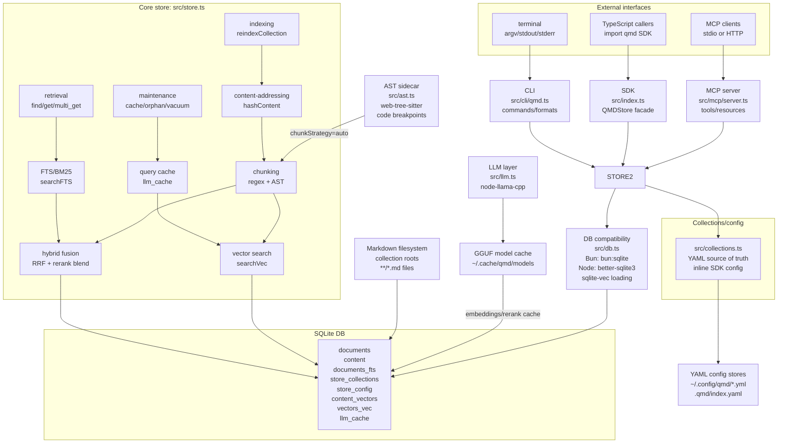
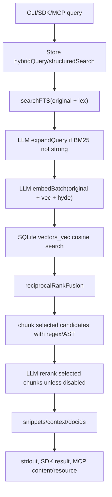
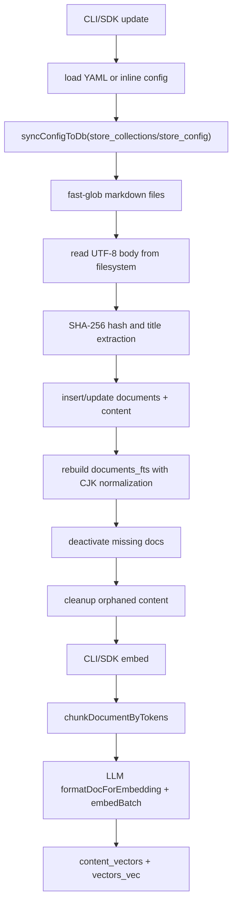

# QMD Master Architecture

## High-Level Architecture

```mermaid
graph TD
    subgraph ExternalInterfaces["External interfaces"]
        TERM["terminal<br/>argv/stdout/stderr"]
        TS["TypeScript callers<br/>import qmd SDK"]
        MCP_CLI["MCP clients<br/>stdio or HTTP"]
    end

    CLI["CLI<br/>src/cli/qmd.ts<br/>commands/formats"]
    SDK2["SDK<br/>src/index.ts<br/>QMDStore facade"]
    MCP_SRV["MCP server<br/>src/mcp/server.ts<br/>tools/resources"]

    TERM --> CLI
    TS --> SDK2
    MCP_CLI --> MCP_SRV

    CLI --> STORE2
    SDK2 --> STORE2
    MCP_SRV --> STORE2

    subgraph CoreStore["Core store: src/store.ts"]
        RET["retrieval<br/>find/get/multi_get"]
        IDX["indexing<br/>reindexCollection"]
        MAINT2["maintenance<br/>cache/orphan/vacuum"]

        FTS2["FTS/BM25<br/>searchFTS"]
        CA["content-addressing<br/>hashContent"]
        QC["query cache<br/>llm_cache"]

        HF["hybrid fusion<br/>RRF + rerank blend"]
        CHUNK["chunking<br/>regex + AST"]
        VS["vector search<br/>searchVec"]

        RET --> FTS2
        IDX --> CA
        MAINT2 --> QC

        FTS2 --> HF
        CA --> CHUNK
        QC --> VS

        CHUNK --> HF
        CHUNK --> VS
    end

    HF --> SQLITE2
    VS --> SQLITE2

    subgraph SQLiteDB["SQLite DB"]
        SQLITE2["documents<br/>content<br/>documents_fts<br/>store_collections<br/>store_config<br/>content_vectors<br/>vectors_vec<br/>llm_cache"]
    end

    MD["Markdown filesystem<br/>collection roots<br/>**/*.md files"] --> SQLITE2

    LLM2["LLM layer<br/>src/llm.ts<br/>node-llama-cpp"] --> GGUF2["GGUF model cache<br/>~/.cache/qmd/models"]
    GGUF2 -->|embeddings/rerank cache| SQLITE2

    DB_COMPAT2["DB compatibility<br/>src/db.ts<br/>Bun: bun:sqlite<br/>Node: better-sqlite3<br/>sqlite-vec loading"] --> SQLITE2

    STORE2 --> DB_COMPAT2
    STORE2 --> COLL3

    subgraph CollectionsConfig["Collections/config"]
        COLL3["src/collections.ts<br/>YAML source of truth<br/>inline SDK config"]
    end

    COLL3 --> YAML2["YAML config stores<br/>~/.config/qmd/*.yml<br/>.qmd/index.yaml"]

    AST3["AST sidecar<br/>src/ast.ts<br/>web-tree-sitter<br/>code breakpoints"] -->|chunkStrategy=auto| CHUNK
```

## Search Query Flow

```mermaid
flowchart TD
    A["CLI/SDK/MCP query"] --> B["Store hybridQuery/structuredSearch"]
    B --> C["searchFTS(original + lex)"]
    C --> D["LLM expandQuery if BM25 not strong"]
    D --> E["LLM embedBatch(original + vec + hyde)"]
    E --> F["SQLite vectors_vec cosine search"]
    F --> G["reciprocalRankFusion"]
    G --> H["chunk selected candidates with regex/AST"]
    H --> I["LLM rerank selected chunks unless disabled"]
    I --> J["snippets/context/docids"]
    J --> K["stdout, SDK result, MCP content/resource"]
```

## Indexing Job Flow

```mermaid
flowchart TD
    A["CLI/SDK update"] --> B["load YAML or inline config"]
    B --> C["syncConfigToDb(store_collections/store_config)"]
    C --> D["fast-glob markdown files"]
    D --> E["read UTF-8 body from filesystem"]
    E --> F["SHA-256 hash and title extraction"]
    F --> G["insert/update documents + content"]
    G --> H["rebuild documents_fts with CJK normalization"]
    H --> I["deactivate missing docs"]
    I --> J["cleanup orphaned content"]
    J --> K["CLI/SDK embed"]
    K --> L["chunkDocumentByTokens"]
    L --> M["LLM formatDocForEmbedding + embedBatch"]
    M --> N["content_vectors + vectors_vec"]
```
