# QMD Command Journeys

## collection add

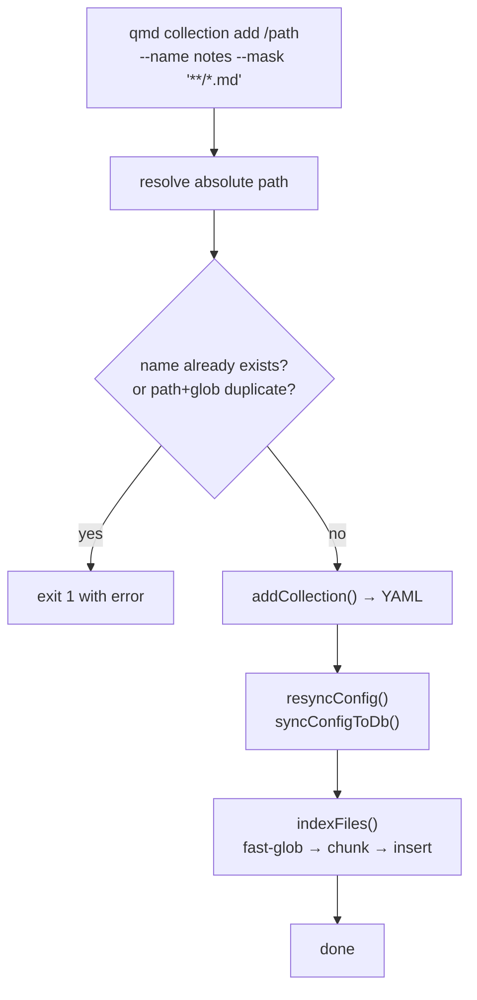

- **What it does:** Registers a new collection in YAML config, syncs to SQLite, and indexes files immediately
- **Key files:** `src/cli/qmd.ts`, `src/collections.ts`, `src/store.ts`
- **Side effects:** Writes `~/.config/qmd/index.yml`, creates `documents`/`content` rows, rebuilds FTS, clears `llm_cache`

---

## collection list

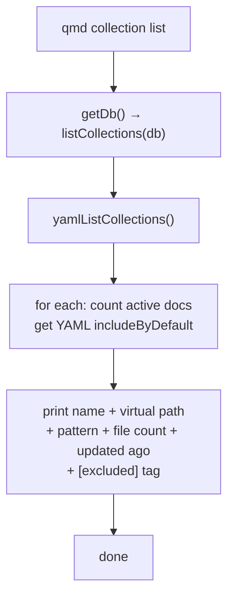

- **What it does:** Prints configured collections from YAML with live DB stats
- **Key files:** `src/cli/qmd.ts`, `src/collections.ts`
- **Side effects:** None (read-only)

---

## collection remove

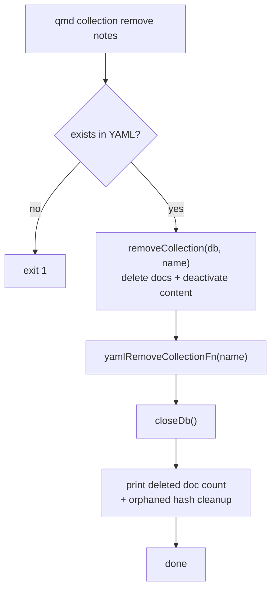

- **What it does:** Removes collection from DB, YAML, and cleans orphaned content hashes
- **Key files:** `src/cli/qmd.ts`, `src/collections.ts`, `src/store.ts`
- **Side effects:** Deletes `documents` rows, updates `store_collections`, writes YAML

---

## collection rename

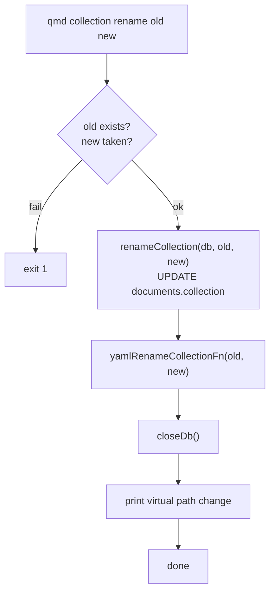

- **What it does:** Renames collection in DB and YAML; virtual paths change from `qmd://old/` to `qmd://new/`
- **Key files:** `src/cli/qmd.ts`, `src/collections.ts`, `src/store.ts`
- **Side effects:** Updates `documents.collection`, `store_collections.name`, writes YAML

---

## ls

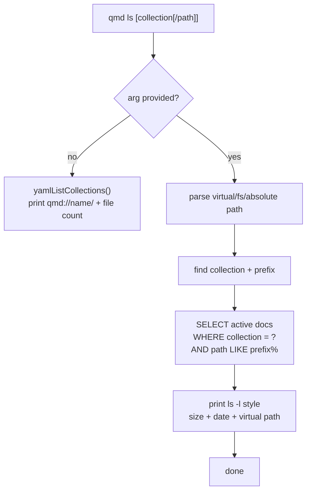

- **What it does:** Lists collections or files inside a collection virtual tree
- **Key files:** `src/cli/qmd.ts`, `src/store.ts`
- **Side effects:** None (read-only)

---

## context add

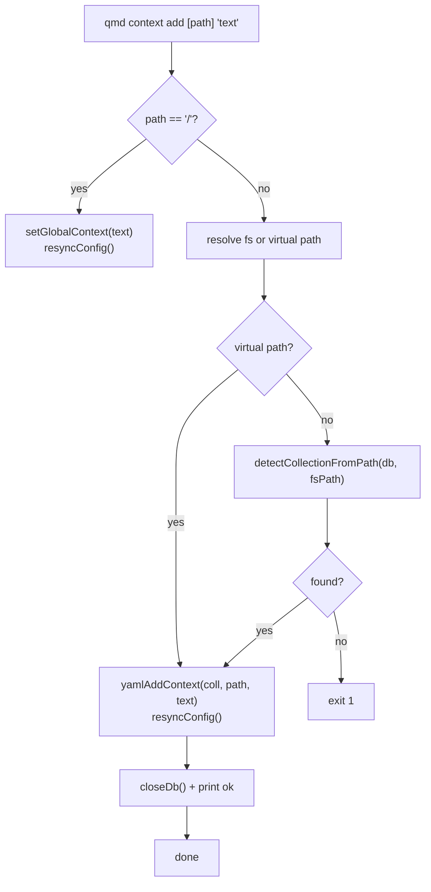

- **What it does:** Attaches context text to global scope, collection root, or subpath
- **Key files:** `src/cli/qmd.ts`, `src/collections.ts`, `src/store.ts`
- **Side effects:** Writes YAML, syncs to `store_collections.context` or `store_config.global_context`

---

## context list

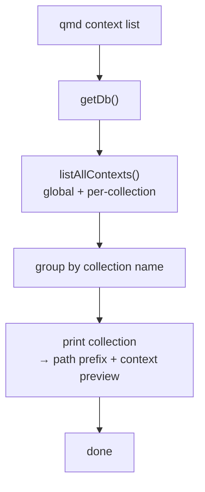

- **What it does:** Prints all contexts grouped by collection
- **Key files:** `src/cli/qmd.ts`, `src/collections.ts`
- **Side effects:** None (read-only)

---

## context rm

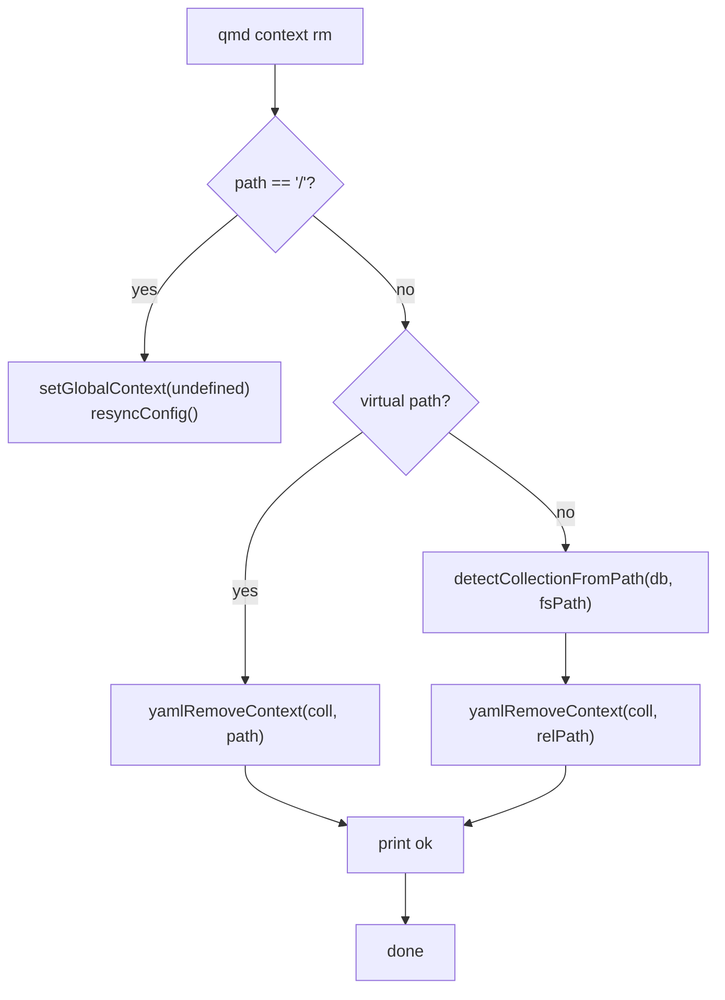

- **What it does:** Removes context entry from YAML and syncs to DB
- **Key files:** `src/cli/qmd.ts`, `src/collections.ts`
- **Side effects:** Writes YAML, updates SQLite synced config

---

## get

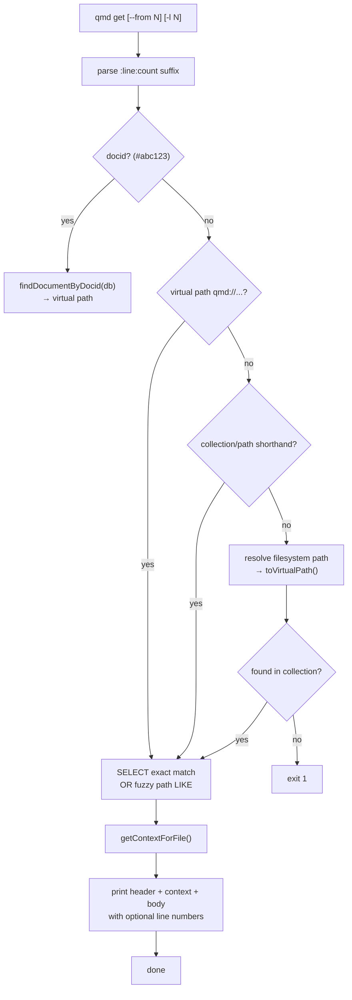

- **What it does:** Fetches a single document by docid, virtual path, collection shorthand, or filesystem path
- **Key files:** `src/cli/qmd.ts`, `src/store.ts`
- **Side effects:** None (read-only)

---

## multi-get

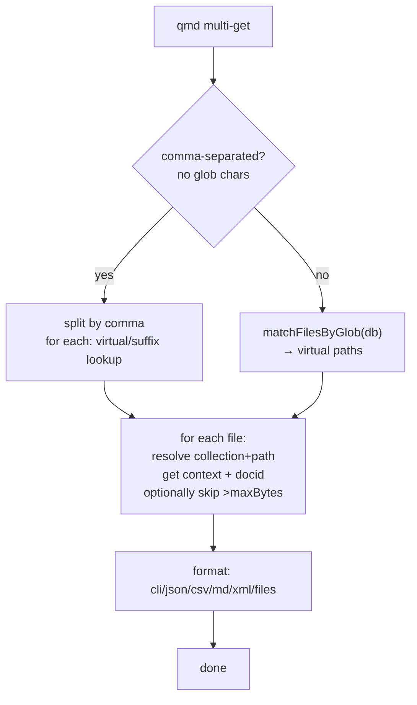

- **What it does:** Retrieves multiple documents by comma list or glob pattern
- **Key files:** `src/cli/qmd.ts`, `src/store.ts`
- **Side effects:** None (read-only)

---

## status

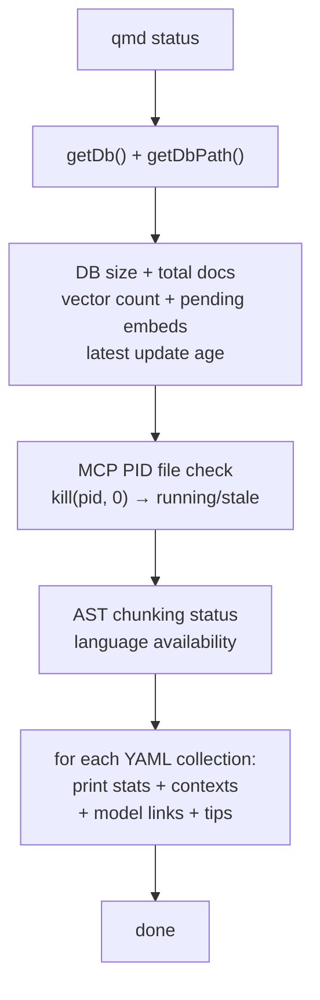

- **What it does:** Prints index health, collections, models, contexts, and actionable tips
- **Key files:** `src/cli/qmd.ts`, `src/store.ts`, `src/ast.ts`
- **Side effects:** Silently deletes stale MCP PID file if found

---

## update

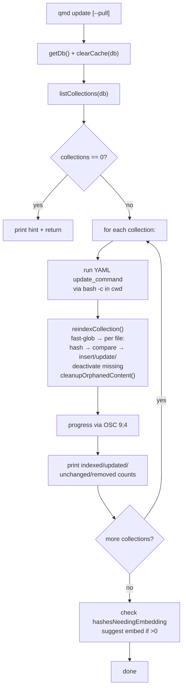

- **What it does:** Re-indexes all collections, runs per-collection update commands, cleans orphans
- **Key files:** `src/cli/qmd.ts`, `src/store.ts`, `src/collections.ts`
- **Side effects:** Writes `documents`, `content`, `documents_fts`, deactivates missing files, deletes orphaned content

---

## embed

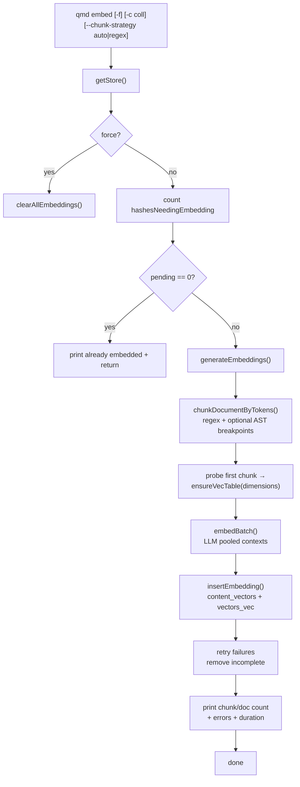

- **What it does:** Generates or refreshes vector embeddings for all pending content hashes
- **Key files:** `src/cli/qmd.ts`, `src/store.ts`, `src/llm.ts`
- **Side effects:** Writes `content_vectors`, creates/updates `vectors_vec` virtual table, progress on stderr

---

## search

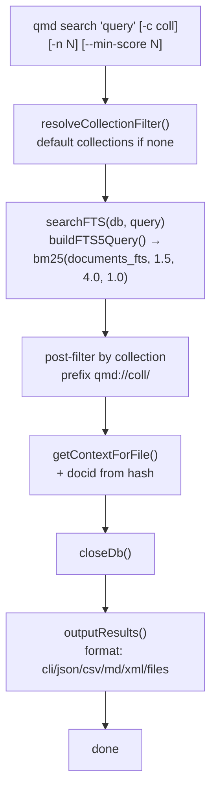

- **What it does:** Fast lexical BM25 search without LLM; weighted title > filepath > body
- **Key files:** `src/cli/qmd.ts`, `src/store.ts`
- **Side effects:** None (read-only)

---

## vsearch

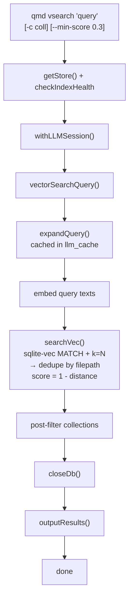

- **What it does:** Vector-only similarity search using sqlite-vec cosine distance
- **Key files:** `src/cli/qmd.ts`, `src/store.ts`, `src/llm.ts`
- **Side effects:** May cache query expansion in `llm_cache`

---

## query

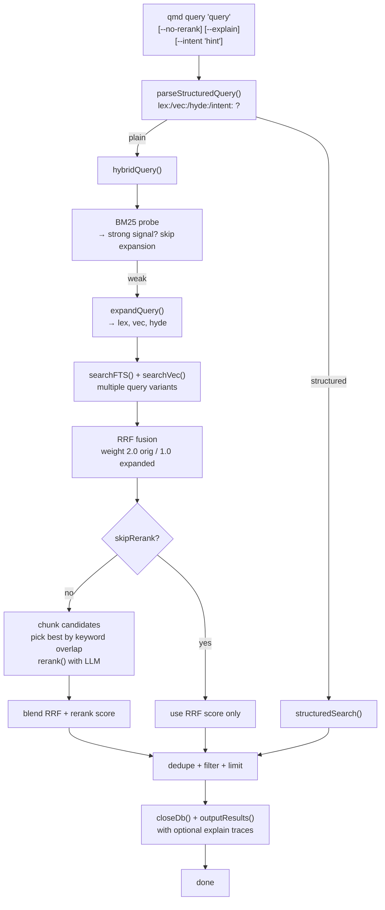

- **What it does:** Recommended hybrid search with query expansion, RRF fusion, and optional LLM reranking
- **Key files:** `src/cli/qmd.ts`, `src/store.ts`, `src/llm.ts`
- **Side effects:** May write `llm_cache` entries for expansions/reranking

---

## mcp

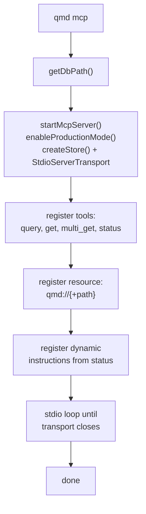

- **What it does:** Starts MCP server over stdio exposing search and document retrieval tools
- **Key files:** `src/mcp/server.ts`, `src/index.ts`
- **Side effects:** Opens DB + LLM; blocks until transport closes

---

## mcp --http --daemon

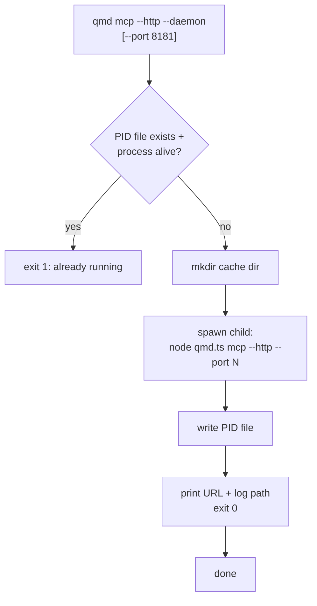

- **What it does:** Detaches an HTTP MCP server as a background daemon
- **Key files:** `src/cli/qmd.ts`, `src/mcp/server.ts`
- **Side effects:** Writes `~/.cache/qmd/mcp.pid` and `mcp.log`, spawns detached child process

---

## mcp stop

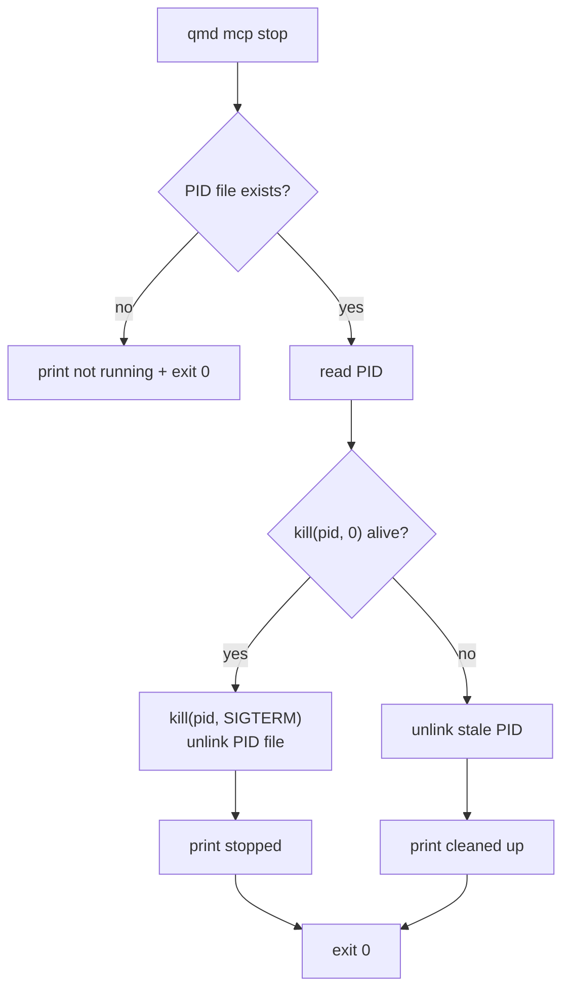

- **What it does:** Terminates the background MCP daemon by PID file
- **Key files:** `src/cli/qmd.ts`
- **Side effects:** Sends SIGTERM, deletes `~/.cache/qmd/mcp.pid`
