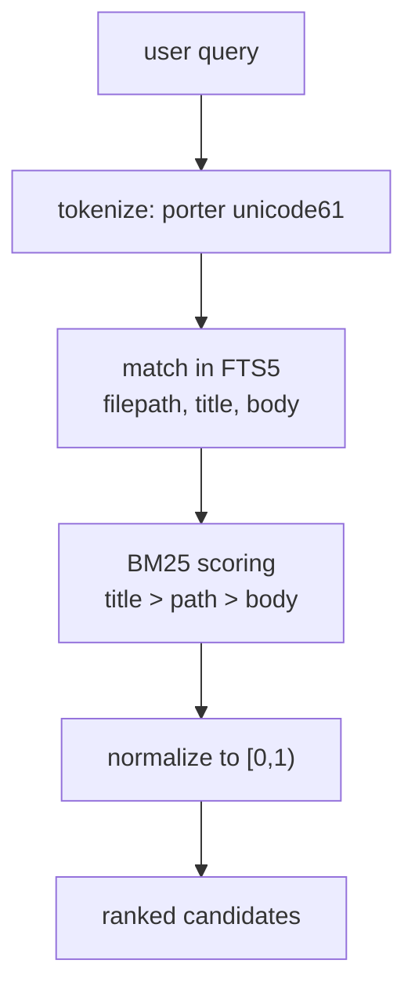
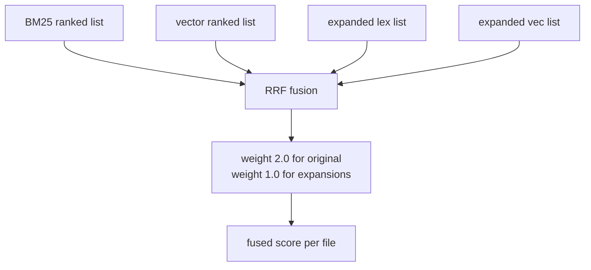
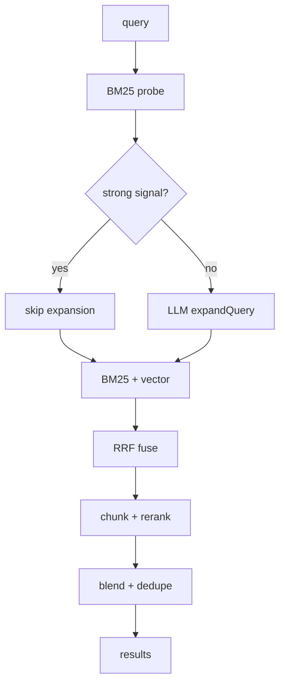
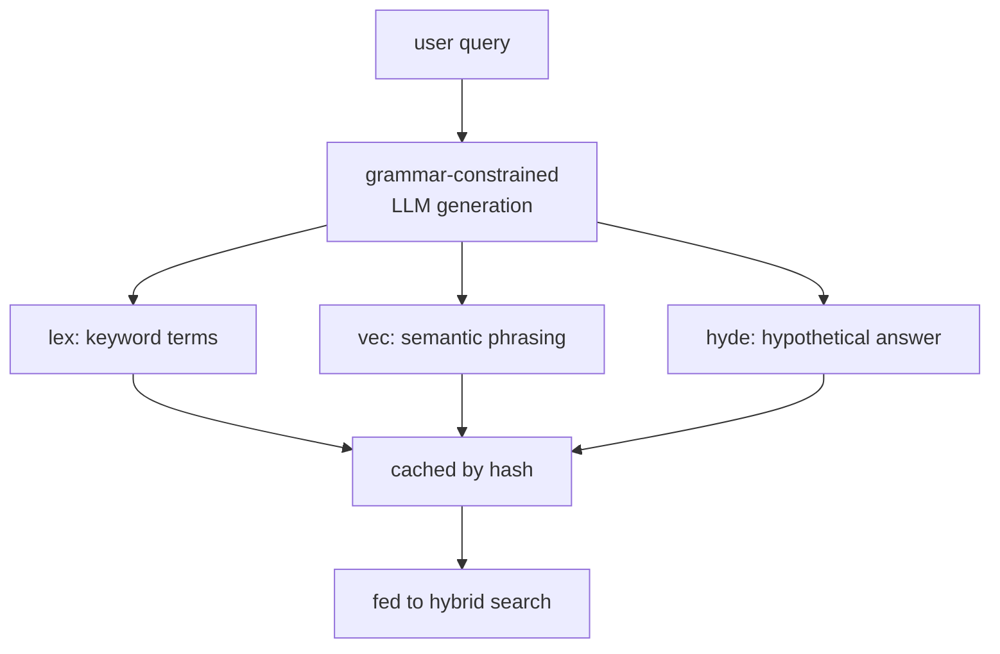
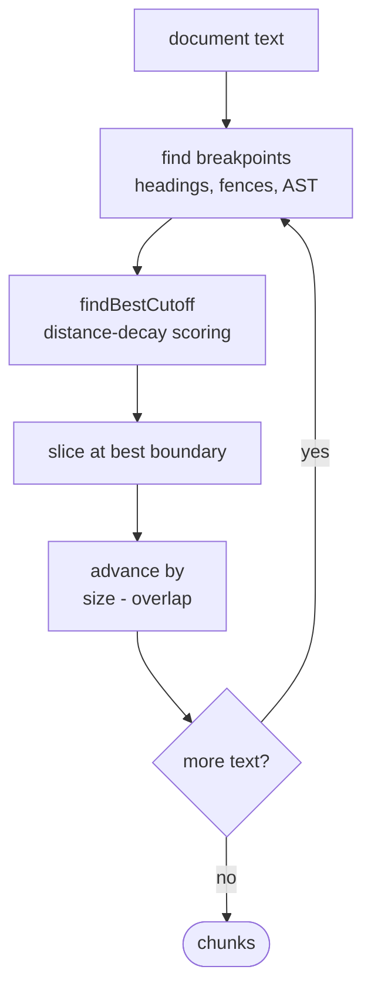
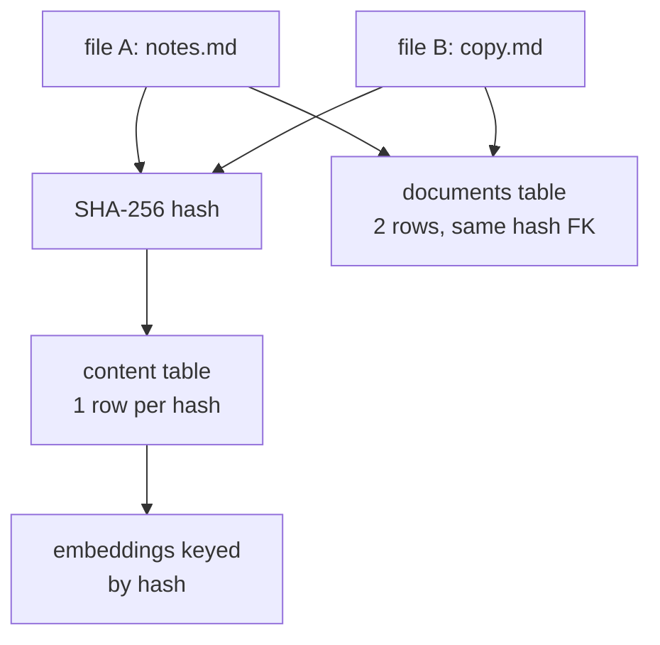
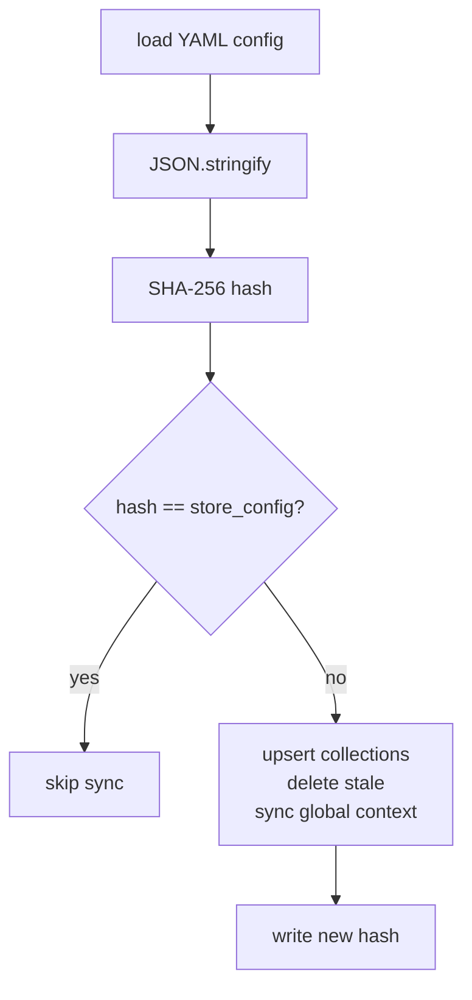
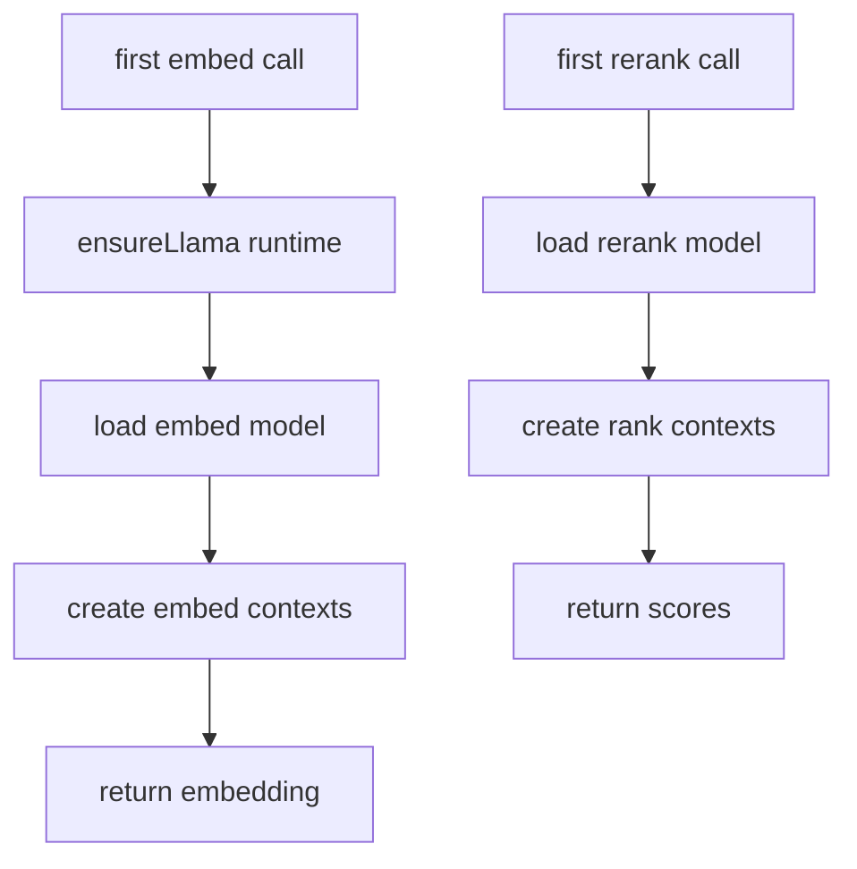

# QMD Technical Concepts Reference

Reference doc for ML/AI practitioners who want to understand the concepts QMD uses without reading source code. Concepts are grouped by category and cross-referenced where relevant.

---

## Search & Retrieval

### BM25 (Okapi BM25)

- **What it is:** A probabilistic ranking function that scores documents by term frequency, inverse document frequency, and document length normalization. Unlike simple TF-IDF, BM25 saturates term frequency so a word appearing 100 times does not dominate a word appearing 10 times.
- **How QMD uses it:** FTS5 computes BM25 over three columns with custom weights: title (4.0), filepath (1.5), body (1.0). Raw scores are normalized to `[0, 1)` via `abs(bm25) / (1 + abs(bm25))` so higher is better.
- **Diagram:**

### Full-Text Search (FTS5)

- **What it is:** SQLite's built-in virtual-table extension for fast inverted-index search. It tokenizes text into terms, builds an index, and supports prefix matching, phrase queries, and boolean `NOT`.
- **How QMD uses it:** `documents_fts` is an FTS5 virtual table synced to the `documents` table via triggers. The production indexing path also explicitly rebuilds FTS rows to apply CJK normalization before triggers fire.
- **See also:** BM25, Snippet Extraction

### Vector Similarity Search

- **What it is:** Finding documents whose embedding vectors are close to a query vector in high-dimensional space. This captures semantic similarity even when no keywords overlap.
- **How QMD uses it:** QMD stores chunk embeddings in a sqlite-vec `vectors_vec` virtual table and queries with `embedding MATCH ? AND k = ?`. Results are deduplicated by filepath, keeping the best distance per file.
- **See also:** Cosine Similarity, sqlite-vec

### Cosine Similarity

- **What it is:** A measure of vector alignment computed as the dot product of two unit-normalized vectors. Value ranges from `-1` (opposite) to `1` (identical); for text embeddings it is typically `[0, 1]` because vectors occupy the same orthant.
- **How QMD uses it:** sqlite-vec is configured with `distance_metric=cosine`. The raw distance returned is converted to similarity with `score = 1 - bestDistance`.

### Reciprocal Rank Fusion (RRF)

- **What it is:** A rank-combination technique that merges multiple ordered result lists into one score without requiring score calibration. Each result's contribution is `weight / (k + rank)`, so top ranks from any list earn high fused scores.
- **How QMD uses it:** BM25 and vector results (plus expansion-derived lists) are fused with `k = 60`. Original-query lists get weight `2.0`; expansion lists get `1.0`. A small top-rank bonus (+0.05 for rank 1, +0.02 for ranks 2-3) breaks ties.
- **Diagram:**

### Hybrid Search

- **What it is:** Combining lexical and semantic search so keyword precision and meaning-based retrieval cover each other's blind spots. Lexical search excels at exact matches (function names, IDs); semantic search catches paraphrases and related concepts.
- **How QMD uses it:** `hybridQuery()` probes BM25 first, conditionally expands the query, runs both lexical and vector searches, fuses results with RRF, chunks candidates, reranks, and blends scores.
- **Diagram:**

### Query Expansion

- **What it is:** Using a language model to rewrite a single user query into multiple search-oriented variants. Each variant is optimized for a different retrieval channel (keyword, semantic, hypothetical answer).
- **How QMD uses it:** `expandQuery()` generates `lex:`, `vec:`, and `hyde:` lines via grammar-constrained LLM generation. Results are cached in `llm_cache` by query hash. Expansion is skipped when the initial BM25 probe already shows a strong signal.
- **Diagram:**

### Reranking

- **What it is:** A second-stage scoring pass that uses a cross-attention model to compare a query directly against each candidate text. Rerankers are more accurate than bi-encoder embeddings but too slow to run over the full index.
- **How QMD uses it:** After RRF fusion, candidate documents are chunked and the best chunk per file is selected by keyword overlap. Only those best chunks are sent to the Qwen3 reranker. The final score is a weighted blend of RRF rank and reranker score.
- **See also:** Hybrid Search, Chunking

### Hypothetical Document Embedding (HyDE)

- **What it is:** A retrieval trick where the query is replaced by a hypothetical ideal answer document, which is then embedded and used for vector search. The idea: an answer text lives closer to relevant documents in embedding space than the original question does.
- **How QMD uses it:** `expandQuery()` can produce a `hyde:` variant. That hypothetical text is embedded like a document and searched via vector similarity alongside the original query embedding.
- **See also:** Query Expansion, Vector Similarity Search

### Strong Signal Detection

- **What it is:** A shortcut heuristic that bypasses expensive LLM work when the initial keyword search is already confident. This saves latency and tokens on queries with obvious lexical matches.
- **How QMD uses it:** If the top BM25 score is >= 0.85 and the gap to the second score is >= 0.15, QMD skips query expansion entirely and proceeds with the original BM25 + vector pipeline. This shortcut is disabled when an explicit `intent` is provided.

### Snippet Extraction

- **What it is:** Selecting a short, relevant excerpt from a document to show the user why it matched. Good snippets contain query terms and enough surrounding context to be meaningful.
- **How QMD uses it:** `extractSnippet()` scores lines by literal query-term matches plus intent-term matches. It can search around a selected chunk with +/-100 characters and returns a diff-style header. If chunk-local matching is poor, it falls back to a full-body excerpt.

---

## Embeddings & LLM

### Text Embeddings

- **What it is:** Dense vector representations of text produced by a neural encoder. Semantically similar texts map to nearby points in the vector space. Embeddings enable similarity search, clustering, and retrieval.
- **How QMD uses it:** Document chunks and queries are embedded via a local GGUF model. The resulting `number[]` vectors are stored in sqlite-vec and compared with cosine distance at search time.
- **See also:** Embedding Model (GGUF), Cosine Similarity

### Embedding Model (GGUF)

- **What it is:** GGUF is a binary format for storing quantized neural network weights, designed for llama.cpp-based inference. It packs model architecture, tokenizer vocab, and compressed weights into one file for efficient CPU/GPU loading.
- **How QMD uses it:** QMD defaults to `embeddinggemma-300M-Q8_0.gguf` for embeddings and `qwen3-reranker-0.6b-q8_0.gguf` for reranking. Models are downloaded from HuggingFace, cached locally, and validated by checking the `GGUF` magic header.

### Tokenization / Context Window

- **What it is:** Tokenization splits text into subword units the model understands. The context window is the maximum token count a model can process in one forward pass. Exceeding it causes truncation or failure.
- **How QMD uses it:** All embedding and reranking inputs are tokenized with the loaded model's tokenizer and truncated to the model's trained context size. QMD also estimates chunk sizes in tokens (default 900) rather than characters for accurate splitting.

### Embedding Fingerprint

- **What it is:** A content hash over the embedding configuration that invalidates stored vectors when anything material changes. This prevents silently comparing vectors produced under different settings.
- **How QMD uses it:** A 6-character SHA-256 prefix computed over model name, query formatter output, document formatter output, chunk size, and chunk overlap. If the fingerprint changes, existing embeddings are treated as stale and re-embedded.

### Local LLM (node-llama-cpp)

- **What it is:** A TypeScript wrapper around llama.cpp that loads GGUF models locally, handles tokenization, manages GPU/CPU backends, and provides embedding, generation, and ranking APIs without network calls.
- **How QMD uses it:** `llm.ts` wraps `node-llama-cpp` for three tasks: embedding chunks/queries, generating query expansions, and reranking candidate chunks. GPU backend (Metal, Vulkan, CUDA) is auto-detected with fallback to CPU.

### Grammar-Constrained Generation

- **What it is:** Restricting LLM output to a formal grammar so the model can only emit valid structured text. This eliminates post-hoc parsing of freeform output and improves reliability for machine-readable results.
- **How QMD uses it:** Query expansion uses a grammar where each line must match `lex: ...`, `vec: ...`, or `hyde: ...`. This guarantees parseable output from the generation model.

### Query Intent

- **What it is:** A user-supplied hint that disambiguates what kind of answer they want. Intent can steer search toward code, prose, design docs, etc.
- **How QMD uses it:** The CLI `--intent` flag and SDK `intent` option are passed to `expandQuery()`, included in the LLM prompt, and used in snippet scoring (intent terms get 0.5 weight vs 1.0 for query terms). Strong-signal bypass is disabled when intent is present.

---

## Chunking

### Document Chunking

- **What it is:** Splitting long documents into smaller pieces so each fits within an embedding model's context window. Good chunking preserves semantic boundaries so no single chunk loses meaning by being cut mid-sentence.
- **How QMD uses it:** Documents are chunked before embedding. Default target is 900 tokens with 15% overlap. Search retrieves the best chunk per document rather than full documents.
- **Diagram:**

### Content-Defined Chunking (Smart Breakpoints)

- **What it is:** Choosing split points based on document structure rather than fixed character counts. A markdown heading is a better boundary than the 900th character in the middle of a paragraph.
- **How QMD uses it:** `BREAK_PATTERNS` assigns scores to structural elements: H1 = 100, H2 = 90, code blocks = 80, blank paragraphs = 20, newlines = 1. `findBestCutoff()` searches backward from the target position and picks the highest-scoring boundary within a window.

### Code Fence Handling

- **What it is:** Preventing chunk splits inside triple-backtick code blocks so code snippets stay intact. A split inside a fence would produce syntactically invalid fragments.
- **How QMD uses it:** `findCodeFences()` scans for newline-prefixed triple backticks and tracks open/close pairs. `isInsideCodeFence()` rejects any candidate breakpoint that falls strictly inside a fenced region. Cuts at fence boundaries are allowed.

### AST-Aware Chunking

- **What it is:** Using a parser (tree-sitter) to find language-specific structural boundaries like function definitions, class declarations, and imports. This produces better chunks for code than markdown-style heuristics.
- **How QMD uses it:** When `chunkStrategy` is `"auto"`, `ast.ts` parses `.ts`, `.tsx`, `.js`, `.py`, `.go`, and `.rs` files with `web-tree-sitter`. AST breakpoints (class = 100, function = 90, import = 60) are merged with regex breakpoints. Markdown and unsupported files fall back to regex.

### Token-Based Chunking

- **What it is:** Measuring chunk size in tokens (model-specific subword units) rather than characters. Two documents of the same character length can differ dramatically in token count.
- **How QMD uses it:** After regex/AST slicing, `chunkDocumentByTokens()` tokenizes each candidate chunk with the LLM tokenizer. Over-limit chunks are recursively re-split using a measured chars-per-token ratio. Final fallback is detokenized truncation.

### Overlap / Sliding Window

- **What it is:** Keeping a small shared region between consecutive chunks so no concept sits only at a boundary and gets lost. Overlap improves retrieval when the relevant span straddles a split.
- **How QMD uses it:** Default overlap is 15% of chunk size (135 tokens / 540 characters). After each slice, the next chunk starts `endPos - overlapChars` characters back. A guard prevents backward movement or duplicate chunks.

---

## Data & Storage

### Content-Addressable Storage

- **What it is:** Storing data by the hash of its content rather than by filename or path. Identical content always maps to the same storage key, enabling automatic deduplication.
- **How QMD uses it:** Document metadata (path, title, collection) lives in `documents`. Body text lives in `content` keyed by SHA-256 hash. Two files with identical content share one `content` row and one embedding set.
- **Diagram:**

### Deduplication by Hash

- **What it is:** Eliminating redundant storage and computation by recognizing that the same bytes do not need to be stored or embedded twice.
- **How QMD uses it:** During indexing, `hashContent()` computes SHA-256. If the hash already exists in `content`, the document row is updated to point to the existing hash. Embeddings are keyed by `hash_seq`, so renames do not invalidate vectors.

### Soft Delete / Inactive Documents

- **What it is:** Marking records as removed without physically deleting them. This preserves history, allows undo, and avoids orphaning referenced data until a cleanup pass runs.
- **How QMD uses it:** When a file disappears from the filesystem, its `documents` row is set to `active = 0` rather than deleted. FTS triggers remove inactive rows from the search index. A later `cleanupOrphanedContent()` pass removes unreferenced content hashes.

### Write-Ahead Logging (WAL)

- **What it is:** A SQLite journaling mode where changes are appended to a separate log file before being merged into the main database. WAL allows readers to proceed without blocking writers and improves crash recovery.
- **How QMD uses it:** `PRAGMA journal_mode = WAL` is set at database open. This keeps indexing and search operations concurrent and resilient.

### SQLite Virtual Tables (FTS5, vec0)

- **What it is:** SQLite extensions that expose special-purpose index engines as queryable tables. FTS5 provides full-text inverted indexes; vec0 (from sqlite-vec) provides vector indexes with approximate nearest-neighbor search.
- **How QMD uses it:** `documents_fts` is a `USING fts5(...)` virtual table for BM25 search. `vectors_vec` is a `USING vec0(...)` virtual table with `embedding float[N] distance_metric=cosine`. Both are maintained by SQLite automatically.

### Config Hash / Lazy Sync

- **What it is:** Avoiding redundant work by checking whether a configuration has changed since last sync. If the serialized config is unchanged, skip the database update.
- **How QMD uses it:** `syncConfigToDb()` JSON-serializes the YAML config, SHA-256 hashes it, and compares it to `store_config.config_hash`. A match returns immediately; a mismatch triggers full SQLite sync and updates the stored hash.
- **Diagram:**

### YAML as Source of Truth

- **What it is:** Using human-editable text files as the canonical configuration, with a derived database copy for runtime speed. YAML is easier to version-control and edit by hand than SQL.
- **How QMD uses it:** Collections, contexts, and model overrides live in YAML. The CLI and SDK mutate YAML first, then mirror into SQLite via `syncConfigToDb()`. DB-only mode skips YAML for programmatic use.

---

## Software Engineering

### Lazy Loading / Lazy Initialization

- **What it is:** Deferring expensive setup (model loading, context creation, database probing) until the moment it is actually needed. This keeps startup fast and avoids work for code paths that never run.
- **How QMD uses it:** The `LlamaCpp` class loads the native runtime, embedding model, generation model, and rerank model only on first use. Embedding and rerank contexts are pooled but created lazily. The store opens the database only when a command needs it.
- **Diagram:**

### Cross-Runtime Compatibility (Bun vs Node)

- **What it is:** Writing code that runs on both Bun (which has a built-in `bun:sqlite`) and Node.js (which needs `better-sqlite3`). The abstraction hides driver differences behind a common interface.
- **How QMD uses it:** `db.ts` detects runtime with `"Bun" in globalThis`, dynamically imports the right driver, and exposes a unified `Database`/`Statement` interface. Extension loading paths differ between runtimes but converge on the same API.

### stdout Redirect (JSON Safety)

- **What it is:** Temporarily swapping `process.stdout.write` so native library diagnostic output goes to stderr instead. This prevents unstructured logs from corrupting machine-readable stdout payloads.
- **How QMD uses it:** `node-llama-cpp` initialization and GPU probing are wrapped in `withNativeStdoutRedirectedToStderr()`. JSON-producing CLI commands (search, get, multi-get) remain clean because all non-data output lands on stderr.

### Virtual Paths

- **What it is:** A stable, collection-scoped URI scheme for identifying documents independently of their absolute filesystem location. `qmd://collection-name/path/to/file.md` means "the file `path/to/file.md` inside the collection named `collection-name`".
- **How QMD uses it:** All search results and document references use `qmd://` URIs. `resolveVirtualPath()` maps a virtual path back to the real filesystem by looking up the collection root from `store_collections`.

### Docids

- **What it is:** Short, content-derived identifiers for documents. Because they are derived from the content hash, identical files across collections share the same docid.
- **How QMD uses it:** Docids are the first 6 hex characters of the SHA-256 content hash. Search results show `#abc123`, and `qmd get #abc123` performs a prefix lookup against active documents.

### Collections (as a Config Concept)

- **What it is:** A named, glob-filtered folder of documents that QMD indexes together. Collections let you group files logically (e.g., `notes`, `docs`, `journals`) and search within subsets.
- **How QMD uses it:** Collections are defined in YAML with `path`, `pattern` (default `**/*.md`), and `ignore_patterns`. They are mirrored into `store_collections`. The CLI `ls`, `search`, and `query` commands can filter by collection.

### Context (as a Search Relevance Concept)

- **What it is:** Human-written descriptive text attached to a path prefix or globally. Context helps disambiguate why files in a folder matter and can be injected into search prompts or MCP instructions.
- **How QMD uses it:** Per-path context maps are stored in YAML and synced to `store_collections.context`. `findContextForPath()` returns the longest matching prefix. Global context applies to all collections. Context appears in `get` output and MCP dynamic instructions.

### Model Lifecycle (load → use → dispose)

- **What it is:** Managing native model resources so GPU memory and CPU threads are not leaked. Models and contexts must be created in order and torn down in reverse.
- **How QMD uses it:** `node-llama-cpp` contexts are disposed before models, models before the runtime. Generation contexts are short-lived (created per call). Embedding/rerank contexts are pooled and disposed after an idle timeout (default 5 minutes). `withLLMSession()` adds reference counting to prevent mid-operation disposal.

### Batch Processing with Retry

- **What it is:** Grouping work into chunks for efficiency, then automatically re-attempting individual failures rather than failing the whole batch. This is essential for long-running embedding jobs where transient errors are common.
- **How QMD uses it:** Embeddings are batched (max 64 docs, 64MB, chunk batches of 32). Failed chunks are tracked by `hash:seq` with up to 3 attempts. Retry happens after 64 successful chunks and again at batch end. If the active error rate exceeds 80%, the batch aborts.

### Graceful Degradation

- **What it is:** Designing a system so that the absence of an optional component does not cause total failure. The core functionality keeps working even when advanced features are unavailable.
- **How QMD uses it:** If sqlite-vec fails to load, FTS/BM25 search continues normally and vector operations are skipped. If AST grammar loading fails, regex chunking is used unchanged. If GPU initialization fails, CPU inference is used. If query expansion fails, fallback variants (`lex`, `vec`) are used automatically.
