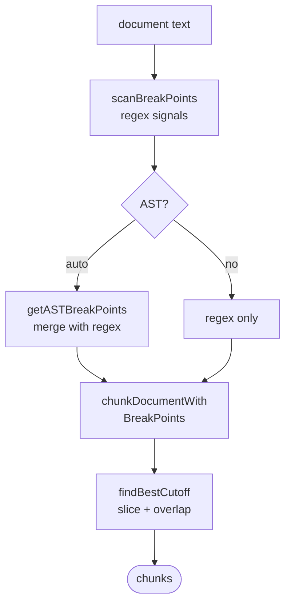
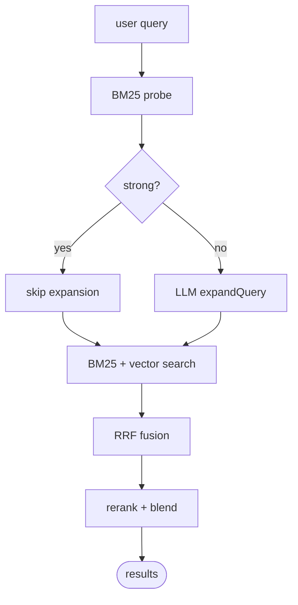
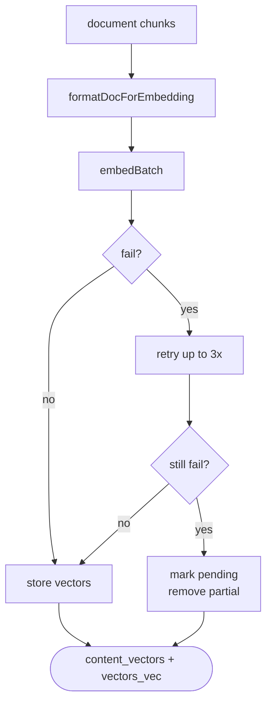
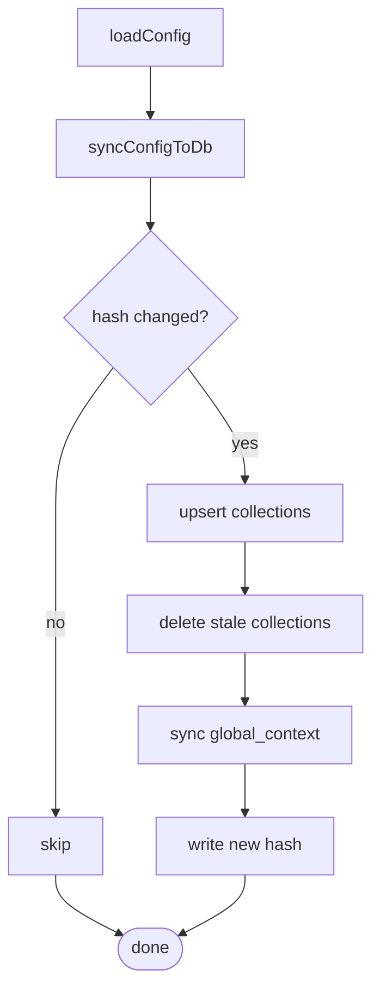

# QMD Deep Dives

## Chunking



### How does regex chunking work?
`scanBreakPoints(text)` runs every regex in `BREAK_PATTERNS`, keeps the highest score per character position, and returns sorted breakpoints. `chunkDocumentWithBreakPoints()` slices from the current position to a target end, calls `findBestCutoff()` to replace the end with the best boundary, then advances by `endPos - overlapChars`.

Key details:
- Markdown headings score higher than paragraph or newline boundaries.
- Overlap preserves context between adjacent chunks.
- Breakpoints are character offsets, not token offsets.

### How does AST chunking work?
`getASTBreakPoints(content, filepath)` in `src/ast.ts` initializes `web-tree-sitter`, loads a language-specific WASM grammar, parses the file, and runs a tree-sitter query to capture declarations and imports. Each capture gets a score aligned with markdown breakpoints (e.g., class = 100, function = 90, import = 60). Results are merged with regex breakpoints when `chunkStrategy === "auto"`.

### How does `findBestCutoff` decide where to split?
It searches backward from the target character position within a window (default 800 chars). Each candidate breakpoint gets a decayed score:

```
multiplier = 1.0 - ((distance / window) ^ 2) * 0.7
finalScore = bp.score * multiplier
```

A strong heading farther back can beat a weak newline near the target because of the squared decay curve.

### Why avoid splitting inside code fences?
`findCodeFences(text)` toggles on newline-prefixed triple backticks. `isInsideCodeFence(pos)` returns true for positions strictly inside a fenced region, so `findBestCutoff` rejects those positions. Cuts are allowed at fence boundaries to keep code blocks intact.

## Search



### What is the full search pipeline?
`hybridQuery()` in `src/store.ts` executes these steps:
1. BM25 probe of the original query.
2. Check strong-signal shortcut; if weak, expand query via LLM.
3. Run lexical queries through FTS.
4. Batch-embed original plus vec/hyde queries and run vector search.
5. Fuse ranked lists with weighted RRF.
6. Chunk candidate documents and select the best chunk per candidate.
7. Optionally rerank selected chunks.
8. Blend RRF position score with rerank score.
9. Deduplicate by file, filter by min score, and limit results.

Key details:
- Expansion produces `lex:`, `vec:`, and `hyde:` variants.
- Original-query lists get higher RRF weight than expansion lists.
- Reranking is late-stage and only sees selected chunks, not full docs.

### What is RRF and how are weights assigned?
Reciprocal Rank Fusion computes contribution as `weight / (k + rank + 1)` with `k = 60`. Original-query lists receive weight `2.0`; expansion-derived lists receive `1.0`. A small bonus is added for top ranks: `+0.05` for rank 1, `+0.02` for ranks 2-3.

### What is reranking and when is it skipped?
Reranking sends the best chunk from each candidate document through the Qwen3 reranker model to produce a relevance score. It is skipped when `--no-rerank` is passed or when reranking is disabled in the SDK. The best chunk is selected by keyword overlap weighting query terms at 1.0 and intent terms at 0.5.

### How are BM25 scores normalized?
Raw BM25 scores from FTS5 are lower-is-better and often negative. `searchFTS()` maps them to a stable positive score with `abs(bm25) / (1 + abs(bm25))`.

### How are vector scores computed?
`searchVec()` queries sqlite-vec for cosine distance, deduplicates by filepath keeping the lowest distance, and returns cosine similarity as `score = 1 - bestDistance`.

## Embeddings



### How are embeddings generated?
`embedBatch()` in `src/llm.ts` splits texts across a pool of embedding contexts. Each text is tokenized and truncated to the model's context window, then `context.getEmbeddingFor(safeText)` returns a native vector that is converted to a plain `number[]`. Failed individual embeddings return `null`.

### What is the embedding fingerprint?
A 6-character SHA-256 prefix computed over the model name, query embedding formatter output, document embedding formatter output, chunk size tokens, and chunk overlap tokens. If any of these changes, existing embeddings are considered stale and must be regenerated.

### What batching strategy is used?
Defaults:
- `maxDocsPerBatch = 64`
- `maxBatchBytes = 64 MB`
- `chunk batch size = 32`

Documents are grouped by hash, then batched by count and byte limit. Chunks are embedded in batches of 32.

### What happens if embedding fails?
Failures are tracked per `hash:seq` with up to 3 attempts and reason strings truncated to 180 characters. After 64 successful chunks, failed chunks are retried; at batch end, all remaining failures are force-retried. If the active error rate exceeds 80% after at least one batch, the batch is aborted. Incomplete embeddings for a hash are removed so the hash remains pending.

## Config



### How does local config discovery work?
`findLocalConfigPath(startDir)` walks upward from the given directory looking for `.qmd/index.yaml` first, then `.qmd/index.yml`. When found, the CLI uses that YAML as the config source and pairs it with `.qmd/index.sqlite` as the database.

### How does config sync to SQLite work?
`syncConfigToDb(db, config)` in `src/store.ts` serializes the config object to JSON, hashes it, and compares it to `store_config.config_hash`. If the hash differs, it upserts collections into `store_collections`, deletes DB collections no longer in YAML, syncs `global_context`, and writes the new hash.

### What is the config hash for?
It is a cheap optimization to avoid re-syncing unchanged YAML into SQLite on every store open. Any semantic change alters the JSON serialization and triggers a sync.

### How does context lookup work?
`findContextForPath(collectionName, filePath)` normalizes both the file path and context prefixes to leading-slash paths, collects all prefix matches, and returns the longest match. If no collection context matches, it falls back to `global_context`.
