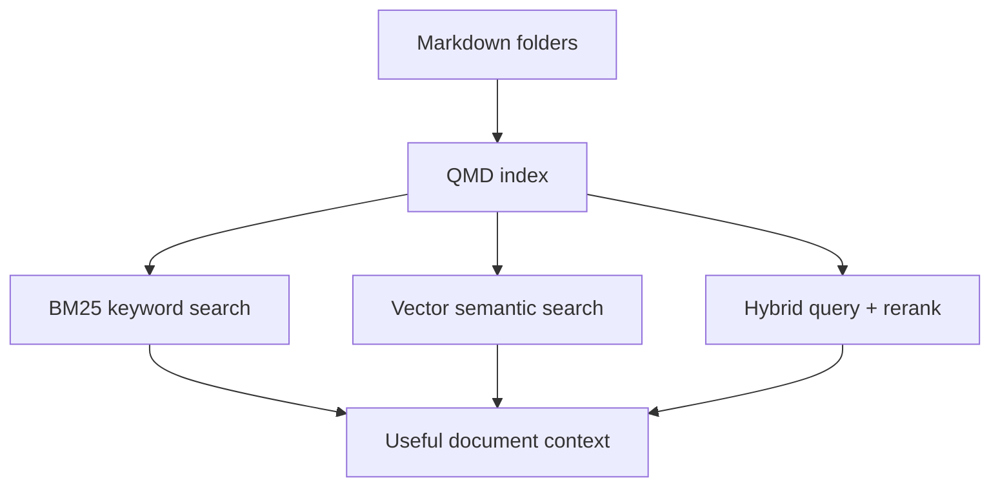
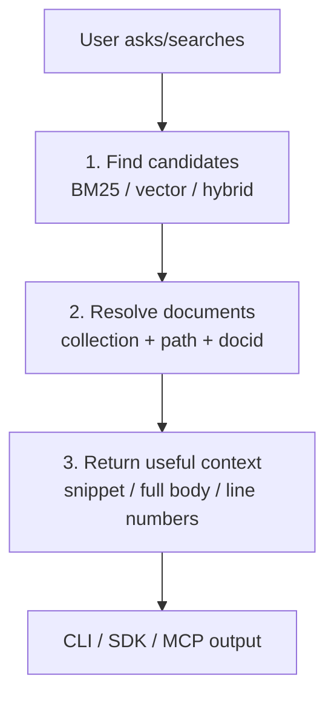

# QMD Master Doc

Reference script for presenting QMD to a technical audience.

Use this as the talk track:

1. What QMD is.
2. Why it exists.
3. What it can do.
4. How retrieval works.
5. Why the architecture matters.

---

## What is QMD?

QMD is a local-first search engine for markdown files.

It indexes folders you configure, stores document content by SHA-256 hash, and lets you search by:

- **keywords** using BM25 / SQLite FTS5
- **meaning** using vector similarity
- **hybrid retrieval** using query expansion, RRF fusion, and reranking

In one sentence: **QMD turns a folder of markdown into a local, agent-friendly retrieval system.**

## What problem does it solve?

QMD sits between `grep` and a full cloud search stack.

- `grep` is fast but only finds exact text.
- Cloud search is powerful but requires infra, network calls, and data leaving your machine.
- QMD gives local search with both lexical and semantic retrieval.

Good example: if your notes contain “token expiration handling,” but you search for “auth timeout bug,” QMD can still find the relevant document.

## Who is it for?

QMD is useful for people with large local text corpora:

- developers searching docs, ADRs, notes, code-adjacent markdown
- researchers searching paper summaries or literature notes
- writers maintaining knowledge bases
- AI agents that need reliable local document retrieval

The core user is someone who wants **private, local, scriptable retrieval** over markdown.

## What can QMD do?

Core capabilities:

1. **Index collections** — named folders of markdown files.
2. **Search lexically** — BM25 over path, title, and body.
3. **Search semantically** — embeddings + sqlite-vec cosine similarity.
4. **Do hybrid search** — query expansion + BM25 + vector + RRF + reranking.
5. **Retrieve evidence** — full docs, snippets, line ranges, glob batches.
6. **Expose retrieval everywhere** — CLI, TypeScript SDK, MCP stdio, MCP HTTP.
7. **Stay local** — SQLite index + local GGUF models.

## What does local-first mean here?

Local-first means:

- documents stay on disk
- index lives in a local SQLite DB
- models are downloaded to `~/.cache/qmd/models`
- no external API is required for normal search

This is useful when the corpus is private, large, or frequently queried by local agents.

## What tech does QMD use?

Important pieces:

| Area | Technology |
|---|---|
| Runtime | TypeScript on Node or Bun |
| Keyword search | SQLite FTS5 / BM25 |
| Vector search | sqlite-vec |
| Local ML | node-llama-cpp + GGUF models |
| Config | YAML collection config |
| Code chunking | optional web-tree-sitter AST breakpoints |
| Interfaces | CLI, SDK, MCP |

## How is QMD different from grep?

`grep` answers: “Which files contain this exact string?”

QMD answers: “Which documents are probably relevant to this question?”

Differences:

- ranks results by relevance
- searches title/path/body with different weights
- supports semantic matches through embeddings
- returns snippets, docids, line ranges, and context
- can retrieve batches for agents

## How is QMD different from Elasticsearch or cloud search?

QMD is much smaller and local.

- no server cluster
- no cloud dependency
- no hosted vector DB
- no data leaving the machine
- simple SQLite-backed index

It is not trying to replace enterprise search. It is trying to make local markdown corpora searchable and agent-friendly.

---

## Retrieval in QMD

Retrieval in QMD means: turn a user question or document identifier into useful markdown content with enough context for a human or agent to act on it.

### 1. Candidate discovery

QMD first finds likely-relevant documents.

- `qmd search` uses **BM25 / FTS5** for exact keyword-style matching.
- `qmd vsearch` uses **vector similarity** for semantic matching.
- `qmd query` combines both, optionally expands the query, fuses rankings with RRF, and reranks best chunks.

This matters because different questions need different signals: exact terms, semantic meaning, or both.

### 2. Document resolution

Once candidates exist, QMD maps them back to stable document identities.

- Documents live inside named **collections**.
- Results use virtual paths like `qmd://docs/api/auth.md`.
- Docids like `#abc123` point to content hashes, so they are easy to cite and retrieve later.

This matters because agents need stable references, not fragile absolute filesystem paths.

### 3. Context packaging

QMD then returns content in a form useful for the caller.

- Search returns ranked files with snippets, scores, docids, and context.
- `qmd get` returns a full document or a line range.
- `qmd multi-get` batches documents for agent workflows.
- MCP and SDK expose the same retrieval path programmatically.

This matters because retrieval is not just “find a file”; it is “return the right evidence in the right shape.”

## Mental Model

Think of QMD retrieval as a three-step pipeline:

1. **Find** relevant candidates.
2. **Resolve** candidates into stable document identities.
3. **Package** content for humans, scripts, SDK callers, or MCP agents.

## Closing Framing

If you are presenting QMD, the simplest framing is:

> QMD is a local retrieval layer for markdown. It gives agents and humans a way to search, cite, and retrieve private knowledge using both classic IR and local ML.
