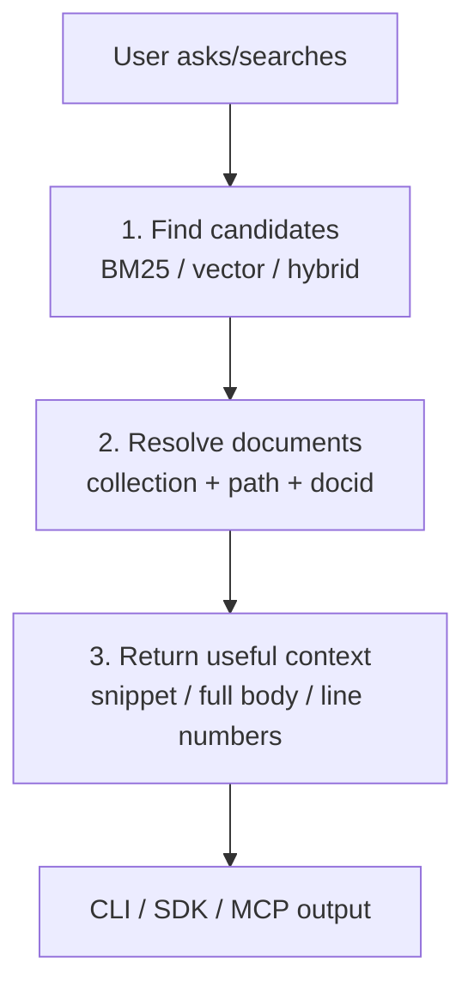

# QMD Master Doc

## Retrieval in QMD

Retrieval in QMD means: turn a user question or document identifier into useful markdown content with enough context for a human or agent to act on it.

### 1. Candidate discovery

QMD first finds likely-relevant documents.

- `qmd search` uses **BM25 / FTS5** for exact keyword-style matching.
- `qmd vsearch` uses **vector similarity** for semantic matching.
- `qmd query` combines both, optionally expands the query, fuses rankings with RRF, and reranks best chunks.

This matters because different questions need different signals: exact terms, semantic meaning, or both.

### 2. Document resolution

Once candidates exist, QMD maps them back to stable document identities.

- Documents live inside named **collections**.
- Results use virtual paths like `qmd://docs/api/auth.md`.
- Docids like `#abc123` point to content hashes, so they are easy to cite and retrieve later.

This matters because agents need stable references, not fragile absolute filesystem paths.

### 3. Context packaging

QMD then returns content in a form useful for the caller.

- Search returns ranked files with snippets, scores, docids, and context.
- `qmd get` returns a full document or a line range.
- `qmd multi-get` batches documents for agent workflows.
- MCP and SDK expose the same retrieval path programmatically.

This matters because retrieval is not just “find a file”; it is “return the right evidence in the right shape.”

## Mental Model

Think of QMD retrieval as a three-step pipeline:

1. **Find** relevant candidates.
2. **Resolve** candidates into stable document identities.
3. **Package** content for humans, scripts, SDK callers, or MCP agents.
